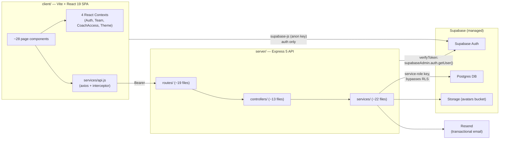
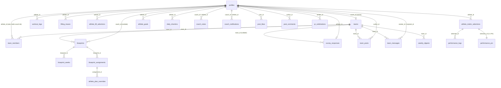
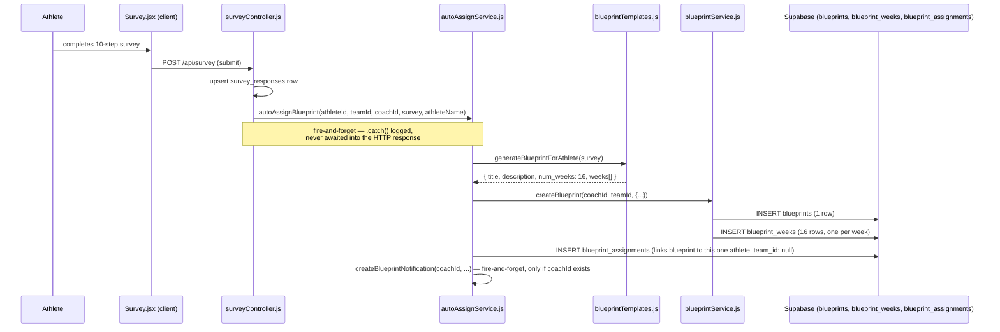

# Offseaz — Codebase Master Context

**Purpose of this document**: This is the canonical engineering reference for the Offseaz codebase. It is written so a new senior engineer (human or a future Claude Code session) can understand every major system before writing code, without re-deriving architecture from scratch. Every claim below is grounded in the actual repository — file paths and line numbers are cited wherever possible. Where something could not be verified directly from the code, it is explicitly marked **"Unable to verify from current repository."** Nothing here is speculative.

This document was produced by direct, exhaustive reading of the codebase (not inference from naming conventions or assumptions), including cross-referencing `CLAUDE.md`'s claims against actual running code — several discrepancies between `CLAUDE.md` and the real implementation are flagged explicitly throughout.

---

## Table of Contents

1. [Project Overview](#1-project-overview)
2. [Technology Stack](#2-technology-stack)
3. [Folder Structure](#3-folder-structure)
4. [Frontend Architecture](#4-frontend-architecture)
5. [Backend Architecture](#5-backend-architecture)
6. [Database Documentation](#6-database-documentation)
7. [Blueprint Generation System](#7-blueprint-generation-system)
8. [Core Feature Documentation](#8-core-feature-documentation)
9. [Authentication](#9-authentication)
10. [Email System](#10-email-system)
11. [Deployment](#11-deployment)
12. [Environment Variables](#12-environment-variables)
13. [Design System](#13-design-system)
14. [Coding Standards](#14-coding-standards)
15. [Performance](#15-performance)
16. [Technical Debt](#16-technical-debt)
17. [Known Risks](#17-known-risks)
18. [Improvement Opportunities](#18-improvement-opportunities)

---

## 1. Project Overview

### What Offseaz is

Offseaz is a coach-first offseason athletic training platform (per `README.md` and `CLAUDE.md`). Coaches create teams, build or auto-generate 16-week training "blueprints," and track athlete accountability throughout the offseason. Athletes join a team via an invite code, complete a 10-step needs-analysis survey, and follow their assigned training plan, logging each session and checking in daily on their readiness. An automated weekly email digest goes to coaches summarizing team activity.

### Primary users

Exactly two roles exist — **coach** and **athlete** — stored in `profiles.role`, not in the auth JWT (see [§9 Authentication](#9-authentication)). There is no admin role and no admin panel. A single user account is one role only; a coach who is also an assistant coach elsewhere is still fundamentally a "coach" role account, distinguished by per-team `access_level` (`head_coach`/`admin_coach`/`view_only`) rather than a separate account type — see [§8.14 Team Management](#814-team-management).

### Core workflows

**Coach workflow**: register/login → create a team (or join an existing team as an assistant coach via a coach code) → share the athlete invite code/link → athletes join → coach reviews each athlete's survey, auto-generated blueprint, and ongoing accountability → coach can manually build/customize blueprints, message athletes, review the team feed and leaderboard, and receive a weekly digest email.

**Athlete workflow**: register (via an invite link, which pre-selects the athlete role) → join a team → complete the 10-step survey → a blueprint is auto-generated in the background (or the coach manually assigns/builds one) → athlete does a daily readiness check-in → athlete follows their weekly training sessions, logging each one's outcome → athlete tracks personal records, offseason goals, and sees their position on the team leaderboard.

### Overall application architecture

Offseaz is a classic two-tier SPA + REST API architecture, with Supabase providing the database, authentication, and file storage as a third-party managed backend layer:



There is no server-side rendering, no GraphQL layer, no ORM, and no message queue. The server is a thin REST wrapper around Supabase's Postgres, with all business logic (blueprint generation, streak calculation, accountability aggregation, etc.) implemented in hand-written JavaScript service functions.

### High-level data flow

Almost every meaningful piece of state in the app lives in Postgres, accessed exclusively through the Express server using the Supabase **service-role** key (which bypasses Row Level Security entirely). The client never queries Postgres directly — it only uses the Supabase JS client for authentication (sign-in/sign-up/session/token retrieval), and all data reads/writes go through the Express API via the shared `axios` instance in `client/src/services/api.js`. This is a deliberate, consistently-followed architectural boundary (see [§4.10](#410-api-layer) and [§9 Authentication](#9-authentication)).

### Request lifecycle

A typical authenticated request (e.g., an athlete logging a workout) flows as follows:

```mermaid
sequenceDiagram
    participant UI as React page
    participant API as api.js (axios instance)
    participant SB as Supabase Auth
    participant MW as verifyToken middleware
    participant Route as Express route
    participant Ctrl as Controller
    participant Svc as Service
    participant PG as Postgres (service-role)

    UI->>API: api.post('/api/workouts', body)
    API->>SB: supabase.auth.getSession() (fresh, every request)
    SB-->>API: access_token
    API->>Route: POST /api/workouts\nAuthorization: Bearer <token>
    Route->>MW: verifyToken(req, res, next)
    MW->>SB: supabaseAdmin.auth.getUser(token)
    SB-->>MW: user object (incl. user_metadata)
    MW->>Route: req.user = user; next()
    Route->>Ctrl: log(req, res)
    Ctrl->>Ctrl: validate body, check role
    Ctrl->>Svc: logSession(athleteId, ...)
    Svc->>PG: upsert workout_logs
    Svc-->>Ctrl: row
    Ctrl-->>UI: 200 { log }
```

Key characteristics of this lifecycle, confirmed across the codebase:
- The client's request interceptor calls `supabase.auth.getSession()` **fresh on every single request** (not cached) to fetch the current access token (`client/src/services/api.js`).
- `verifyToken` (`server/src/middleware/verifyToken.js`) is the **only** authentication middleware; it populates `req.user` with the full Supabase user object. There is no separate role-checking middleware — every controller/route handler that needs role gating does its own `getProfile(req.user.id)` lookup and compares `profile.role`.
- There is **no global Express error-handling middleware** — every controller/route handles its own try/catch and shapes its own error response.
- Almost every write operation that should notify someone (coach notifications, blueprint auto-assignment) is fire-and-forget: the triggering request's HTTP response does not wait for these side effects to complete, and their failures are only logged server-side, never surfaced to the end user.

---

## 2. Technology Stack

### Client (`client/package.json`)

| Category | Package | Declared range | Resolved (package-lock.json) |
|---|---|---|---|
| Framework | `react` | `^19.2.5` | 19.2.6 |
| Framework | `react-dom` | `^19.2.5` | (matches react) |
| Routing | `react-router-dom` | `^7.15.0` | 7.15.0 |
| HTTP client | `axios` | `^1.16.0` | 1.16.0 |
| Backend SDK | `@supabase/supabase-js` | `^2.105.4` | 2.105.4 |
| Build tool | `vite` | `^8.0.10` | 8.0.11 |
| Vite plugin | `@vitejs/plugin-react` | `^6.0.1` | — |
| Linting | `eslint` | `^10.2.1` | 10.3.0 |
| Linting | `@eslint/js` | `^10.0.1` | — |
| Linting | `eslint-plugin-react-hooks` | `^7.1.1` | — |
| Linting | `eslint-plugin-react-refresh` | `^0.5.2` | — |
| Linting | `globals` | `^17.5.0` | — |
| Types (editor only) | `@types/react`, `@types/react-dom` | `^19.2.14`, `^19.2.3` | — |

No TypeScript compiler is a dependency — only `@types/*` packages for editor intellisense. **All source files are `.jsx`/`.js`; zero `.ts`/`.tsx` files exist anywhere in the tree.**

### Server (`server/package.json`)

| Category | Package | Declared range |
|---|---|---|
| Framework | `express` | `^5.2.1` (resolved 5.2.1) |
| Backend SDK | `@supabase/supabase-js` | `^2.105.4` |
| CORS | `cors` | `^2.8.6` |
| Env loading | `dotenv` | `^17.4.2` |
| Cron scheduling | `node-cron` | `^4.2.1` |
| Email | `resend` | `^6.12.3` |
| Dev-only autoreload | `nodemon` | `^3.1.14` (devDependencies only) |

`"type": "commonjs"` (`server/package.json:13`) — all server files use `require`/`module.exports`.

**Node version**: `server/.nvmrc` = `20` (single line, no `v` prefix), matching `"engines": { "node": ">=20" }` in `server/package.json:26`.

**Package manager**: npm — both `client/package-lock.json` and `server/package-lock.json` exist; no `yarn.lock` or `pnpm-lock.yaml` anywhere.

### Database / Auth / ORM

- **Database**: Supabase-hosted Postgres.
- **ORM**: **None.** Raw `@supabase/supabase-js` client calls (`.from('table').select()/.insert()/.update()/.delete()`) throughout every service and controller. There is no query builder, no generated types, no compile-time schema safety.
- **Auth provider**: Supabase Auth. Client uses `supabase.auth.signInWithPassword()`/`signUp()`/`getSession()` (`client/src/services/supabase.js`). Server validates tokens via `supabaseAdmin.auth.getUser(token)` (`server/src/middleware/verifyToken.js`).
- **Admin client**: `server/src/config/supabase.js` creates a single service-role-privileged client with `auth: { autoRefreshToken: false, persistSession: false }` — correct for a stateless server client with no user session to persist. This client **bypasses Row Level Security entirely** and is imported directly by every controller/service that touches the DB. The anon key is never used server-side.

### Deployment

- **Server → Railway**, config at root `railway.json`:
  ```json
  {
    "$schema": "https://railway.app/railway.schema.json",
    "build": { "builder": "NIXPACKS", "buildCommand": "npm install" },
    "deploy": {
      "startCommand": "node src/index.js",
      "restartPolicyType": "ON_FAILURE",
      "restartPolicyMaxRetries": 10
    }
  }
  ```
  No `cd server &&` prefix — Railway's dashboard Root Directory is set to `server/`, so these commands already run from that subdirectory.
- **Client → Vercel**, config at `client/vercel.json`:
  ```json
  { "routes": [{ "handle": "filesystem" }, { "src": "/(.*)", "dest": "/index.html" }] }
  ```
  A catch-all SPA rewrite so client-side React Router deep links don't 404.

### Email

**Resend** (`resend` npm package, `^6.12.3`), used in three files: `server/src/services/digestService.js` (live weekly digest), `server/src/services/summaryService.js` (**dead code — see §10**), and `server/src/routes/contact.js` (public contact form). Full detail in [§10](#10-email-system).

### Storage

**Supabase Storage is used** — one bucket, `avatars`, serving two purposes:
1. **Profile avatars** — `server/src/controllers/authController.js` (`updateAvatar`) decodes a client-sent base64 data URL, enforces a 4 MB cap, uploads to path `${userId}/avatar.${ext}` via the service-role client (explicit code comment: "bypasses storage RLS entirely"), then writes the resulting public URL into `profiles.avatar_url`.
2. **Feed photos** — `server/src/services/feedService.js` (`uploadFeedPhoto`/`deleteFeedPhoto`) uses the **same** `avatars` bucket under a `feed-photos/` subfolder, 5 MB cap, supports jpeg/png/webp/gif.

`express.json({ limit: '15mb' })` (`server/src/index.js:33`) exists specifically to accommodate these base64 payloads. No other Storage bucket is referenced anywhere in the repo.

### Build tool, linting, formatting, testing

- **Build tool**: Vite. Config at `client/vite.config.js` — minimal, just `plugins: [react()]`.
- **Linting**: ESLint 10 flat config (`client/eslint.config.js`) — ignores `dist`, applies to `**/*.{js,jsx}`, extends `js.configs.recommended` + `reactHooks.configs.flat.recommended` + `reactRefresh.configs.vite`, browser globals + JSX parsing. **No custom rule overrides.** Server has no ESLint config at all.
- **Formatting**: **No Prettier or any formatter configured anywhere** (no `.prettierrc*`, no formatter dependency in either `package.json`). Confirmed absent.
- **Testing**: **No test runner configured.** No jest/vitest/mocha/cypress/playwright/testing-library in either `package.json` or lockfile. No `*.test.js`/`*.spec.js` files exist anywhere. This matches `CLAUDE.md`'s own statement ("No test runner is configured") and is confirmed independently.
- **Animation libraries**: None (no framer-motion/gsap/react-spring/lottie). All animation is plain CSS, consistent with the inline-styles-only convention.
- **Charts**: None (no chart.js/recharts/d3).
- **Icons**: Hand-built. `client/src/components/Icons.jsx` (710 lines) defines a custom stroke-based SVG icon library plus a separate multicolor "sport icon" family — see [§13.6](#136-icon-system).

---

## 3. Folder Structure

Full tree (excluding `node_modules`, `.git`, `dist`, and `.claude/worktrees/*`):

```
offseaz/
├── CLAUDE.md                      Project instructions for Claude Code sessions
├── README.md                      One-line project description
├── railway.json                   Railway build/deploy config (server)
├── .gitignore
│
├── supabase/
│   └── migrations/                Canonical incremental-migration home (correct location)
│       ├── assistant_coaches.sql
│       ├── digest_enabled.sql
│       ├── lift_selections.sql
│       ├── performance_prs.sql
│       └── weekly_digests.sql
│
├── client/                        Vite + React 19 SPA → Vercel
│   ├── package.json / package-lock.json
│   ├── vite.config.js / eslint.config.js / vercel.json
│   ├── index.html
│   ├── .env / .env.development / .env.example
│   ├── public/                    Static assets served verbatim at the web root
│   │   ├── *.png / *.jpg / *.webp / *.svg   (logos, favicons, about-page photography, PWA icons)
│   │   ├── manifest.json          PWA manifest
│   │   └── migrations/            ⚠ ANOMALY — see below
│   │       ├── multi_team_coach.sql
│   │       └── teamless_athlete_preview.sql
│   └── src/
│       ├── main.jsx / App.jsx / App.css / index.css
│       ├── assets/                 hero.png, react.svg, vite.svg (Vite scaffold leftovers)
│       ├── components/             Layout, Sidebar, ProtectedRoute, AvatarUpload,
│       │                           ExerciseInfoButton, Icons, PRCelebration,
│       │                           PreviewBanner, ReadinessCheckin, SessionDescription, Wordmark
│       ├── context/                AuthContext, CoachAccessContext, TeamContext, ThemeContext
│       ├── data/                   exerciseLibrary.js (static exercise metadata)
│       ├── hooks/                  empty except .gitkeep — no shared custom-hooks directory in use
│       ├── pages/                  ~28 route-level page components
│       └── services/               api.js (axios instance), supabase.js (browser Supabase client)
│
└── server/                        Express 5 API → Railway
    ├── package.json / package-lock.json / .nvmrc / .env / .env.example
    └── src/
        ├── index.js                App bootstrap, route mounting, CORS, PostgREST schema-cache probe
        ├── scheduler.js             node-cron jobs, required after app.listen()
        ├── config/                  supabase.js — single service-role admin client factory
        ├── routes/                  ~19 route files, one per resource
        ├── controllers/             ~13 controller files (thin HTTP layer over services)
        ├── services/                ~22 service files (business logic + all Supabase queries)
        ├── middleware/               verifyToken.js
        └── data/                     blueprintTemplates.js (the entire blueprint-generation system)
```

### Purpose of key folders

- **`client/src/pages/`**: one file per route, matching the routes registered in `App.jsx`. Every page follows the "inline styles only" convention — `const styles = {}` at the bottom of the file, no CSS modules, no Tailwind.
- **`client/src/components/`**: shared, reusable UI pieces used across multiple pages (nav/layout chrome, auth guarding, icon library, avatar upload widget, animated celebrations).
- **`client/src/context/`**: the four React Contexts that form the app's entire cross-cutting state layer — there is no Redux/Zustand/MobX anywhere.
- **`client/src/services/`**: exactly two files — `api.js` (the required axios wrapper for all backend calls) and `supabase.js` (browser Supabase client, auth-only).
- **`client/src/hooks/`**: currently empty (only `.gitkeep`) — reserved for future custom hooks; the app currently duplicates hook-like logic (e.g., mobile-breakpoint detection) independently in multiple files instead.
- **`server/src/routes/` → `controllers/` → `services/` → `config/`**: the layered pattern from `CLAUDE.md` — routes wire URLs to controller functions, controllers handle HTTP concerns, services contain the actual Supabase queries and business logic. **Not universally followed** — see [§5.1](#51-server-structure-and-layering) for the specific exceptions.
- **`server/src/data/blueprintTemplates.js`**: the entire blueprint-generation system (2,239 lines) — see [§7](#7-blueprint-generation-system).

### ⚠ Flagged anomaly: `client/public/migrations/`

Confirmed to be a **misplaced folder, not intentional**. It contains two git-tracked SQL migration files (`multi_team_coach.sql`, `teamless_athlete_preview.sql`) that nothing in the client source references (a repo-wide grep for `"migrations"` across `client/src`, `client/index.html`, and `client/vite.config.js` returns zero matches). Because everything under `client/public/` is copied verbatim into `client/dist/` and deployed to Vercel as static assets, **these two SQL files are publicly downloadable in production** at paths like `https://<vercel-domain>/migrations/multi_team_coach.sql`. Neither file contains secrets (they are pure DDL/`ALTER TABLE` statements — one drops a unique constraint on `teams.coach_id`, the other makes `survey_responses.team_id`/`blueprints.coach_id` nullable), so the immediate risk is schema-disclosure rather than credential leakage, but it is still an unintended public exposure and inconsistent with the project's own `supabase/migrations/` convention. **These two files should be moved into `supabase/migrations/` and deleted from `client/public/`.**

---

## 4. Frontend Architecture

### 4.1 App shell / component hierarchy

`client/src/App.jsx` is the composition root. Provider/router nesting order (`App.jsx:162-259`):

```
ErrorBoundary                          (class component — the ONLY class component in the codebase)
  ThemeProvider
    BrowserRouter
      ScrollToTop                      (renders null, side-effect only)
      AuthProvider
        TeamProvider
          Routes
            (CoachAccessProvider mounted only inside the /coach route subtree, not globally)
```

`ErrorBoundary` (`App.jsx:37-121`) catches render crashes, logs to `console.error`, and renders a fallback UI showing the error message, the first crashing component's name, and the full component stack — this is the only production error-visibility mechanism, since there is no error-tracking service (e.g. Sentry) wired up anywhere.

`ScrollToTop` (`App.jsx:14-34`) uses `useLayoutEffect` to force-reset scroll position synchronously on every route change and disables `history.scrollRestoration` once on mount.

### 4.2 Routing table (react-router-dom v7)

All routes declared in `App.jsx:170-251`.

**Public (no auth):** `/`, `/login`, `/register`, `/join/:code`, `/privacy`, `/terms`, `/refund`, `/accessibility` (all four from `Legal.jsx`), `/about`, `/contact`.

**Athlete-only standalone** (protected, no `Layout`/sidebar): `/survey`, `/athlete/onboarding`.

**Coach branch** — `/coach` parent wraps children in `ProtectedRoute requiredRole="coach"` → `CoachAccessProvider` → `Layout`:
`/coach` (index → `CoachDashboard`), `/coach/athletes`, `/coach/athletes/:id`, `/coach/blueprints`, `/coach/blueprints/new`, `/coach/blueprints/:id`, `/coach/messages`, `/coach/accountability`, `/coach/feed`, `/coach/leaderboard`, `/coach/athletes/:id/report`, `/coach/profile`.

**Athlete branch** — `/athlete` parent wraps children in `ProtectedRoute requiredRole="athlete"` → `Layout` (no `CoachAccessProvider`):
`/athlete` (index → `AthleteDashboard`), `/athlete/plan`, `/athlete/messages`, `/athlete/roster`, `/athlete/roster/:athleteId`, `/athlete/leaderboard`, `/athlete/profile`, `/athlete/feed`.

`Messages`, `Leaderboard`, and `Feed` are single shared page components reused under both `/coach/*` and `/athlete/*`.

**Legacy redirects**: `/plan → /athlete/plan`, `/accountability → /coach/accountability`, `/blueprints/new → /coach/blueprints/new`, `/messages → MessagesRedirect` (an inline component that reads `profile.role` and redirects appropriately). **Catch-all**: `* → NotFound`.

### 4.3 `Layout.jsx` — shell wrapping nested routes

Renders `<Sidebar />` + a `<main>` containing `<Outlet />`. Desktop applies `marginLeft: 240` to clear the fixed sidebar; mobile applies `marginLeft: 0` (sidebar becomes a bottom tab bar) with extra bottom padding (`calc(80px + env(safe-area-inset-bottom))`) to clear the fixed bottom bar and iOS home-indicator. `Layout.jsx` also renders `CoachTeamSwitcherBar` — a mobile-only sticky bar + slide-up sheet for switching active coach team, shown only when `profile.role === 'coach'` and the coach has ≥2 teams, reading `useCoachAccess()` defensively since that context is `null` on athlete routes.

### 4.4 `Sidebar.jsx` — navigation

Branches on the exported `useIsMobile()` hook (polls `window.innerWidth < 768` with a resize listener) between `DesktopSidebar` (fixed 240px vertical nav) and `BottomBar` (mobile fixed bottom tab bar with 4 primary tabs + a "More" drawer). Nav configs are static arrays (`COACH_NAV`/`ATHLETE_NAV` for desktop, `COACH_PRIMARY`/`COACH_MORE`/`ATHLETE_PRIMARY`/`ATHLETE_MORE` for mobile). A per-item accent color cycles through orange/blue/yellow by index modulo 3 — decorative, not role-tied. `useNotifBadge(isCoach)` polls `/api/notifications` once on mount (coaches only), coloring the badge red if any notification is `injury_flag` type, otherwise orange.

### 4.5 `ProtectedRoute.jsx` — access gating logic

The **only** route-level access-control mechanism in the client. Logic in order: (1) `loading` → full-screen branded spinner; (2) no `session` → redirect to `/login`; (3) `session` but no `profile` → also redirect to `/login` (guards against `profile.role` being `undefined`, which would otherwise misroute a coach to `/athlete`); (4) `requiredRole` prop set and `profile.role !== requiredRole` → redirect to the *correct* dashboard for the actual role; (5) otherwise render `children`. Beyond this, the only other access control is UI-level gating inside pages using `CoachAccessContext`'s `canEdit`/`isHeadCoach` booleans (not route-level).

### 4.6 Authentication flow (client side)

1. `Login.jsx` calls `supabase.auth.signInWithPassword({ email, password })` directly (Supabase auth calls always go through `services/supabase.js`, never the REST API).
2. On success, `Login.jsx` immediately calls `GET /api/auth/profile` itself, passing the just-obtained token explicitly (not relying on the interceptor, since Supabase client session state may not have propagated yet), to determine `role` and navigate to `/coach` or `/athlete`.
3. Independently, `AuthContext` subscribes to `supabase.auth.getSession()` and `onAuthStateChange`, storing the session in state.
4. A second effect fires whenever `session` changes; if a session exists, it fetches `/api/auth/profile` via the shared `api` instance and stores the result in `profile` state — deduplicating redundant fetches via a `lastFetchedToken` ref (since `getSession()` and `onAuthStateChange` can both fire for the same session).
5. `ProtectedRoute` reads `session`/`profile`/`loading` from this same context to gate every protected route render.

`signOut()` resets the dedup ref, calls `supabase.auth.signOut()`, and clears `profile`. `updateProfile(partial)` is exposed for optimistic local profile patches (e.g. after avatar upload) without a full re-fetch. Full server-side signup/login detail is in [§9](#9-authentication).

### 4.7 The four context providers

| Context | Holds | Loaded when | Persistence | Mount point |
|---|---|---|---|---|
| **`AuthContext`** | `{ session, profile, loading, signOut, updateProfile }` | Always (global) | — | `App.jsx`, wraps entire `<Routes>` tree |
| **`TeamContext`** | `{ teams, teamsLoading, activeTeam, activeTeamId, setActiveTeamId, refreshTeams }` | Only when `profile.role === 'athlete'` (`GET /api/teams/my-teams`) | `activeTeamId` → `localStorage['offseaz_active_team']` | `App.jsx`, wraps entire tree (even coach routes — silently no-ops there) |
| **`CoachAccessContext`** | `{ team, teams, activeTeamId, setActiveTeamId, accessLevel, isHeadCoach, canEdit, loading, refresh }` | `GET /api/teams/my-coach-teams` | `activeTeamId` → `localStorage['offseaz_active_coach_team']` (separate key from TeamContext's) | Only inside `/coach` route subtree — the one context that deviates from "always available" |
| **`ThemeContext`** | Nothing reactive — not actually a React Context (no `createContext`/`Provider`, no `useTheme()` hook) | Once, on mount | — | `App.jsx`, outermost provider |

`ThemeProvider` runs a `useLayoutEffect` once to set a hardcoded `DARK_VARS` object of CSS custom properties directly onto `document.documentElement.style` and sets `data-theme="dark"`. Comment in the file states "Offseaz is dark-mode only" — there is no light-mode toggle anywhere. This duplicates the `:root` tokens already in `client/src/index.css` — two sources of truth for the same dark-mode palette that must be kept in sync manually (see [§16 Technical Debt](#16-technical-debt)).

### 4.8 State management approach

Confirmed: **no Redux, no Zustand, no MobX** — the client's only state-management dependencies are React itself. All cross-cutting state lives in the 4 contexts above; all local/page state uses `useState`/`useEffect`. This is a deliberate, consistently-applied choice across every page sampled.

### 4.9 Custom hooks

`client/src/hooks/` contains **only** a `.gitkeep` — no shared custom-hooks directory is in active use. The only hook-like functions are defined inline, locally:
- `useIsMobile()` — exported from `Sidebar.jsx`, also imported by `Layout.jsx`. The one hook shared across more than one file.
- `useNotifBadge(isCoach)` — private to `Sidebar.jsx`.
- **Duplicated, not shared**: ad-hoc `isMobile` state is reimplemented independently (not via `useIsMobile()`) in `AthleteMyProfile.jsx` (600px breakpoint) and `BlueprintBuilder.jsx` (768px breakpoint) — three separate `window.innerWidth` + resize-listener implementations of the same concept, with two different, inconsistent breakpoints.

### 4.10 API layer

`client/src/services/api.js` (22 lines) creates a single axios instance with `baseURL: import.meta.env.VITE_API_URL` — **throws synchronously at module-import time** if unset (a fail-fast guard). The request interceptor is `async`: on every outgoing request, it calls `supabase.auth.getSession()` fresh (not cached) and attaches `Authorization: Bearer <token>` if present. **No response interceptor exists** — there is no centralized 401 handling, no token-refresh logic, no global error toast; each caller handles errors independently.

`client/src/services/supabase.js` (7 lines) — trivial `createClient(VITE_SUPABASE_URL, VITE_SUPABASE_ANON_KEY)`. Used exclusively for `supabase.auth.*` calls; never for direct table queries from the client.

### 4.11 Data-fetching pattern

Confirmed dominant pattern across every page: `useEffect(() => { api.get(...).then(...).catch(...).finally(() => setLoading(false)) }, [deps])` paired with local `useState` for data/loading/error. Examples: `CoachDashboard.jsx` runs `Promise.all([...4 api.get calls...])` inside one `useEffect`, each with its own `.catch(() => [])` fallback so one failing endpoint doesn't break the page; `AthleteDashboard.jsx` follows the same shape plus a nested goal-auto-seeding side effect. **No `react-query`, `SWR`, or any caching/data-fetching library exists** — every fetch is a fresh network call on mount with no request deduplication, background refetch, or cache invalidation beyond what each context manually implements.

### 4.12 Error handling patterns

**Inconsistent across the app.** Two distinct styles:
1. **User-visible error state** — `Login.jsx`, `CoachDashboard.jsx` (`error`/`joinError`/`newTeamError` state variables rendered as inline error boxes).
2. **Silent swallow** — many `.catch(() => {})`/`.catch(() => [])` calls with no user feedback: `CoachDashboard.jsx` (all 4 dashboard data fetches swallow errors into empty-array fallbacks — a failed API call produces an empty section with no error message), `TeamContext.jsx`, `CoachAccessContext.jsx`, `AthleteDashboard.jsx` (multiple `.catch(() => null)`/`.catch(() => [])`).

Some places log to `console.error` before swallowing (developer-visible, not user-visible). **There is no consistent policy** for when an error should surface vs. fail silently — decided ad hoc per call site based on whether the data is "critical" (survey/plan — silently treated as absent) vs. "action" (form submission — shown as an error box).

### 4.13 Loading state patterns

**Two competing patterns, not unified:**
1. **Skeleton screens** via the global `.skeleton` CSS class (shimmer animation) — used in `CoachDashboard.jsx` and `AthleteDashboard.jsx`.
2. **Plain "Loading…" text** — `ProtectedRoute.jsx` renders a full-screen spinner + "Loading…" while auth resolves; `AthleteDashboard.jsx` renders literal "Loading team…" text for one specific case (no skeleton).

A third indicator (a CSS `spin` keyframe) is used for small inline spinners (`.survey-spinner`, `.survey-spinner-sm`, ad hoc spinning divs in `AvatarUpload.jsx` and modal buttons). Three loading-UI conventions coexist with no single standard.

### 4.14 Modal system

**No shared `Modal` component exists** (confirmed by grep — zero `function Modal`/`const Modal` definitions anywhere). Every modal/overlay is hand-rolled per component using the same manual recipe: a `position: fixed, inset: 0` overlay `<div onClick={close}>` containing an inner card `<div onClick={e => e.stopPropagation()}>`. Confirmed independent instances in `ExerciseInfoButton.jsx`, `CoachDashboard.jsx` (new-team modal), `BlueprintBuilder.jsx` (×2 — `EditDrawer`, `BulkEditModal`), `ReadinessCheckin.jsx`, `PRCelebration.jsx`, `AvatarUpload.jsx` (crop modal) — 6+ duplicated implementations of identical overlay boilerplate.

### 4.15 Toast / notification system

**None exists.** No toast library, no `toast`/`Toast` matches anywhere in `client/src`. User feedback (e.g. "Copied") is implemented ad hoc per component using local boolean state + `setTimeout` (e.g. `CoachDashboard.jsx` has three separate instances: `copiedAthleteCode`/`copiedCoachCode`/`copiedLink`, each independently reset via `setTimeout(() => setX(false), 2000)`). The in-app "notifications" feature (bell badge, injury flags, achievements) is a **domain feature**, not a generic UI toast system — see [§8.6](#86-notifications).

### 4.16 Reusable components inventory

| File | Purpose |
|---|---|
| `AvatarUpload.jsx` | Profile photo upload with drag-to-reposition/pinch-to-zoom circular crop before upload |
| `ExerciseInfoButton.jsx` | ⓘ button opening a modal with exercise description + a YouTube search link, sourced from `exerciseLibrary.js` |
| `Icons.jsx` | Central SVG icon library — ~40 stroke utility icons + ~14 multicolor "sport" icons |
| `Layout.jsx` | App shell wrapper: `Sidebar` + `<Outlet/>` + mobile `CoachTeamSwitcherBar` |
| `PRCelebration.jsx` | Full-screen animated PR celebration — CSS confetti + a from-scratch Canvas 2D shareable-image generator + native Web Share/download |
| `PreviewBanner.jsx` | Banner shown to teamless athletes prompting an invite code |
| `ProtectedRoute.jsx` | Route-level auth/role gate |
| `ReadinessCheckin.jsx` | Daily check-in modal — sleep/soreness/energy scoring, rest-day branch |
| `SessionDescription.jsx` | Renders a session's description text with exercise info buttons, injury-based substitution logic (client-side mirror of server logic), caution badges, and %-of-max weight calculation |
| `Sidebar.jsx` | Responsive navigation; also exports `useIsMobile()` |
| `Wordmark.jsx` | "Offseaz" text logo, each letter individually brand-colored |

---

## 5. Backend Architecture

### 5.1 Server structure and layering

The declared pattern is `routes/ → controllers/ → services/ → config/supabase.js`. This is **followed consistently for the 14 "core" resources** with dedicated controller files, but there are **explicit exceptions** where routes call services (or the DB) directly, skipping the controller layer:

- `server/src/routes/contact.js` — no controller, no service; builds the Resend email HTML inline and calls `resend.emails.send()` directly.
- `server/src/routes/digest.js` — test-only route (`POST /api/digest/send-now`, marked `TODO: REMOVE BEFORE LAUNCH`), calls `supabaseAdmin` and `digestService.runWeeklyDigest` directly, no controller.
- `server/src/routes/checkins.js` — calls `authService.getProfile`/`checkinService` functions directly inline; no `checkinController.js` exists.
- `server/src/routes/leaderboard.js`, `server/src/routes/maxes.js` (the lift-selection endpoints specifically), and `server/src/routes/performance.js` — same pattern, services called directly from route files.

`server/src/index.js` mounts 19 route modules under `/api/*`. `programController.js` also embeds a raw `supabaseAdmin.from('program_completions').insert(...)` directly in the controller rather than delegating to a service — a partial breach of the thin-controller convention (the controller file even embeds the `CREATE TABLE` DDL as a comment, suggesting this endpoint was hand-added without following the usual pattern).

### 5.2 Full route inventory

| Route file | Method + Path | Handler |
|---|---|---|
| `auth.js` → `authController.js` | `POST /api/auth/register` | `register` (unprotected — no `verifyToken`) |
| | `GET /api/auth/profile` | `profile` |
| | `PATCH /api/auth/avatar` | `updateAvatar` |
| | `PATCH /api/auth/name` | `updateName` |
| | `PATCH /api/auth/privacy` | `updatePrivacy` |
| | `PATCH /api/auth/digest-preference` | `updateDigestPreference` |
| `teams.js` → `teamsController.js` | `POST /api/teams/` | `create` |
| | `GET /api/teams/my-coach-teams` | `myCoachTeams` |
| | `GET /api/teams/mine` | `mine` |
| | `POST /api/teams/join` | `join` |
| | `POST /api/teams/join-as-coach` | `joinAsCoach` |
| | `GET /api/teams/my-team` | `athleteTeam` |
| | `GET /api/teams/my-teams` | `athleteTeams` |
| | `GET /api/teams/coaches` | `coaches` |
| | `PATCH /api/teams/coaches/:coachId/access` | `updateCoachAccess` |
| | `DELETE /api/teams/coaches/:coachId` | `removeCoach` |
| | `POST /api/teams/transfer-ownership` | `transferOwnership` |
| `survey.js` → `surveyController.js` | `POST /api/survey/` | `submit` |
| | `PUT /api/survey/` | `update` |
| | `GET /api/survey/my` | `mysurvey` |
| | `GET /api/survey/team` | `teamSurveys` |
| | `PATCH /api/survey/physical` | `updatePhysical` |
| `blueprints.js` → `blueprintController.js` | `GET /api/blueprints/templates` | `listTemplates` |
| | `POST /api/blueprints/templates/generate` | `generateFromTemplate` |
| | `GET /api/blueprints/my-plan` | `myPlan` |
| | `GET /api/blueprints/overrides/:athleteId` | `getOverrides` |
| | `POST /api/blueprints/overrides/:athleteId` | `saveOverrides` |
| | `POST /api/blueprints/` | `create` |
| | `GET /api/blueprints/` | `list` |
| | `GET /api/blueprints/:id` | `detail` |
| | `POST /api/blueprints/:id/assign` | `assign` |
| | `POST /api/blueprints/:id/assign-bulk` | `bulkAssign` |
| | `PATCH /api/blueprints/:id/lock` | `lock` |
| | `DELETE /api/blueprints/:id` | `remove` |
| `workouts.js` → `workoutController.js` | `POST /api/workouts/` | `log` |
| | `GET /api/workouts/mine` | `mine` |
| | `GET /api/workouts/team` | `teamLogs` |
| | `GET /api/workouts/accountability` | `accountability` |
| `messages.js` → `messageController.js` | `GET /api/messages/athletes` | `athletes` |
| | `GET /api/messages/conversations` | `conversations` |
| | `GET /api/messages/thread/:convId` | `thread` |
| | `POST /api/messages/thread/:convId` | `send` |
| `athletes.js` → `athleteController.js` | `GET /api/athletes/:id` | `profile` |
| | `PUT /api/athletes/:id/notes` | `saveNote` |
| `maxes.js` → mixed | `GET /api/maxes/selections` | inline (`getSelectedLifts`) |
| | `POST /api/maxes/selections/:liftKey` | inline (`addLiftSelection`) |
| | `DELETE /api/maxes/selections/:liftKey` | inline (`removeLiftSelection`) |
| | `PUT /api/maxes/selections` | inline (`updateLiftSelections`) |
| | `GET /api/maxes/` | `getMyMaxes` |
| | `POST /api/maxes/` | `addMax` |
| | `GET /api/maxes/:athleteId` | `getAthleteMaxes` |
| `roster.js` → `rosterController.js` | `GET /api/roster/` | `roster` |
| | `DELETE /api/roster/:athleteId` | `removeAthleteFromTeam` |
| | `GET /api/roster/:athleteId` | `teammateProfile` |
| `notifications.js` → `notificationController.js` | `GET /api/notifications/` | `list` |
| | `PATCH /api/notifications/dismiss-athlete/:athleteId` | `dismissByAthlete` |
| `feed.js` → `feedController.js` | `GET /api/feed/` | `getFeedHandler` |
| | `POST /api/feed/` | `createPostHandler` |
| | `POST /api/feed/photos` | `uploadPhotoHandler` |
| | `DELETE /api/feed/comments/:commentId` | `deleteCommentHandler` |
| | `DELETE /api/feed/:postId` | `deletePostHandler` |
| | `POST /api/feed/:postId/like` | `toggleLikeHandler` |
| | `POST /api/feed/:postId/comments` | `addCommentHandler` |
| `goals.js` → `goalsController.js` | `GET /api/goals/` | `getMyGoals` |
| | `POST /api/goals/` | `createGoalHandler` |
| | `PATCH /api/goals/:id` | `updateGoalHandler` |
| | `DELETE /api/goals/:id` | `deleteGoalHandler` |
| | `GET /api/goals/athlete/:athleteId` | `getAthleteGoalsForCoach` |
| `report.js` → `reportController.js` | `GET /api/report/:athleteId` | `getReport` |
| `programs.js` → `programController.js` | `POST /api/programs/complete` | `complete` |
| `contact.js` — no controller | `POST /api/contact/` | inline (unprotected, sends Resend email) |
| `digest.js` — no controller, `TODO: REMOVE BEFORE LAUNCH` | `POST /api/digest/send-now` | inline, gated by `x-digest-secret` header, not `verifyToken` |
| `checkins.js` — no controller | `GET /api/checkins/today` | inline |
| | `POST /api/checkins/` | inline |
| | `GET /api/checkins/team` | inline |
| `leaderboard.js` — no controller | `GET /api/leaderboard/` | inline |
| `performance.js` — no controller | `GET /api/performance/definitions` | inline (public, unprotected) |
| | `GET /api/performance/mine` | inline |
| | `POST /api/performance/selections` | inline |
| | `DELETE /api/performance/selections/:selectionId` | inline |
| | `POST /api/performance/log` | inline |
| | `GET /api/performance/selections/:selectionId/history` | inline |
| | `GET /api/performance/athlete/:athleteId` | inline |
| | `GET /api/performance/athlete/:athleteId/selections/:selectionId/history` | inline |

### 5.3 Middleware

- **`server/src/middleware/verifyToken.js`** (21 lines): reads `Authorization: Bearer <token>`; 401s if missing/malformed. Calls `supabaseAdmin.auth.getUser(token)`; 401s on error/missing user. On success, sets `req.user = data.user` — the full Supabase auth user object including `user_metadata`. **This is the only auth middleware** — there is no separate role-check middleware; role gating is hand-rolled per-controller.
- **CORS**: `cors({ origin: process.env.CORS_ORIGIN || '*', allowedHeaders: ['Content-Type','Authorization'], methods: ['GET','POST','PUT','PATCH','DELETE','OPTIONS'] })`.
- **Body parsing**: `express.json({ limit: '15mb' })` — generous limit specifically for client-compressed base64 avatar/photo uploads.
- **No global error-handling middleware exists.** No Express 4-arg error handler (`app.use((err, req, res, next) => ...)`) anywhere. Every route/controller handles its own try/catch. An unhandled synchronous throw outside a try/catch, or a rejected promise not caught, would produce Express's default (inconsistent-shape) error response rather than the app's normal `{ error: "..." }` JSON shape.

### 5.4 Validation approach

**No schema validation library** (no zod/joi/express-validator/yup) anywhere in `server/src`. All validation is hand-rolled per-controller/route, inline at the top of each handler: e.g. `workoutController.js` (manual required-field + status-enum + effort-range checks), `blueprintController.js` (`num_weeks` range 1–16), `maxesController.js` (`weight_lbs` positive + upper-bound 2000), `checkins.js` (inline 1–5 range check for the three readiness scores).

### 5.5 Error handling patterns (PGRST116 / 23505)

Applied **inconsistently** — present in most controllers that plausibly need it, absent in several that could still hit those codes:

**Handled**: `authController.js` (`PGRST116` → profile auto-create from `user_metadata`; `23505` on register → 409 "Profile already exists"), `athleteController.js` (`PGRST116` → 404), `teamsController.js` (`PGRST116` → 404 invalid code; `23505` → 409 already a member), `surveyController.js` (`23505` → 409 survey already submitted; `PGRST116` on `updatePhysical` → 404), `blueprintController.js` (`PGRST116` → 404 "Blueprint not found" on `detail`/`assign`/`lock`/`bulkAssign`/`remove` — notably **not** applied to `create`).

**Not handled** (generic 400/500 for everything instead): `goalsController.js`, `feedController.js`, `messageController.js`, `notificationController.js`, and the route-inline handlers in `checkinService.js`/`leaderboardService.js`/`performanceService.js` (except a few explicit string-matching checks like `err.message.includes('already')` in `routes/performance.js`).

### 5.6 Business logic separation

Mostly thin controllers / fat services, with known leaks:
- **Clean**: `teamsController.js`, `blueprintController.js`, `workoutController.js`, `rosterController.js` — do auth/role checks + validation, delegate all DB work to services.
- **Leakage into controller**: `programController.js` directly calls `supabaseAdmin.from('program_completions').insert(...)` instead of using a service (no `programService.js` exists).
- **Leakage into route files**: `checkins.js`, `leaderboard.js`, `performance.js`, `contact.js`, `digest.js`, and part of `maxes.js` put controller-equivalent logic (role checks, response shaping) directly in the Express route file.

### 5.7 Blueprint generation logic — pointer

Lives in `server/src/data/blueprintTemplates.js` (the template catalog and generator functions), `server/src/services/blueprintService.js` (CRUD for `blueprints`/`blueprint_weeks`/`blueprint_assignments`/`athlete_plan_overrides`), and `server/src/services/autoAssignService.js` (the fire-and-forget trigger called from `surveyController.js` after survey submit). **Full deep-dive in [§7](#7-blueprint-generation-system).**

### 5.8 Notification logic

`server/src/services/notificationService.js` (123 lines) is a single-table (`coach_notifications`) service with upsert/insert functions all keyed on `(coach_id, athlete_id, type)` as the upsert conflict target:
- `createInjuryNotification` — type `injury_flag`, on survey injury flag.
- `createBlueprintNotification` — type `blueprint_assigned`, from `autoAssignService`.
- `createCoachJoinNotification` — type `coach_joined`, when an assistant coach joins via coach code.
- `createProgramCompletionNotification` — type `program_complete`, when an athlete chooses "wait for coach" after finishing their program.
- `createOwnershipTransferNotification` — type `ownership_transfer`, plain insert (not upsert), self-notifies the new head coach.
- `getCoachNotifications(coachId)` / `dismissAthleteNotifications(coachId, athleteId)` — read/dismiss.

All notification-creation calls in controllers are **fire-and-forget** (`.catch(e => console.error(...))`), never blocking the HTTP response.

### 5.9 Cron jobs / scheduled tasks

`server/src/scheduler.js` (32 lines) registers exactly two `node-cron` jobs at module load time, required after `app.listen()` in `index.js` (so a syntax error here would not block server startup, but a runtime throw inside the callbacks would only surface when the cron fires):

1. **Weekly coach digest** — `cron.schedule('0 8 * * 1', ..., { timezone: 'America/Chicago' })`, Monday 8:00 AM Central. Calls `digestService.runWeeklyDigest()` wrapped in try/catch that only logs on failure.
2. **Nightly streak reset** — `cron.schedule('0 0 * * *', ...)`, no explicit timezone (defaults to the container's TZ, i.e. UTC on Railway). Calls `streakService.runNightlyStreakReset()`, same try/catch-and-log pattern.

**Important discrepancy with `CLAUDE.md`**: `CLAUDE.md` states "A crash in the scheduler kills the process; Railway restarts it." Direct inspection of `scheduler.js` shows **both cron callbacks are already wrapped in try/catch that only logs and does not rethrow** — a crash inside either scheduled callback should not crash the whole process today. This appears to describe either a now-superseded state of the file, or a residual risk confined to code paths outside these try/catch blocks (e.g. an un-awaited fire-and-forget promise spawned deep inside `runWeeklyDigest`/`runNightlyStreakReset` that isn't caught by the outer `await`). **This should be flagged to the team and either `CLAUDE.md` corrected or the scheduler's deeper call chain audited.**

Also worth noting: `server/src/services/summaryService.js` defines `runWeeklySummary()` (which would implement the "weekly email summary every Sunday" described in `CLAUDE.md`) but **it is never called anywhere in the current codebase** — not from `scheduler.js`, not from any route. This is dead code, superseded by `digestService.js`'s `runWeeklyDigest` (which actually runs, Monday 8am Central, not Sunday). The `weekly_summaries` table and `CLAUDE.md`'s "Sunday 8pm" description are both stale relative to the actual live schedule.

Additionally, `index.js`'s `probeSchemaCache()` runs once at startup (not cron) — an async self-check pinging PostgREST's schema cache and probing `athlete_lift_selections` visibility, to help debug PostgREST schema-cache-staleness after a migration. Errors here are caught and logged only, never crash the process.

---

## 6. Database Documentation

There is **no full `schema.sql` in this repository** — `supabase/migrations/` contains only 5 narrow, incremental `ALTER TABLE`-style patch files, none of which create the foundational tables. This is a real onboarding/disaster-recovery gap (see [§17 Known Risks](#17-known-risks)). The table documentation below is assembled from (a) the 7 migration SQL files that do exist (5 in `supabase/migrations/`, 2 misplaced in `client/public/migrations/`), and (b) reverse-engineering every `.from('table_name')` call across all server services/controllers. Any table whose full column list is not confirmed by an actual migration file is explicitly marked.

### 6.1 Entity relationship overview (as reverse-engineered)



### 6.2 Tables with confirmed DDL (found in migration files)

**`teams`** (base table pre-dates migrations; altered by 2 migrations)
- Altered by `supabase/migrations/assistant_coaches.sql` — adds `coach_code TEXT UNIQUE` (separate invite code for assistant coaches), backfilled for existing rows via `md5(id || random())`.
- Altered by `client/public/migrations/multi_team_coach.sql` — drops any unique constraint on `coach_id` (allowing one coach to own multiple teams), adds index `idx_teams_coach_id`.
- Index: `idx_teams_coach_code`.
- Purpose: one row per coach-owned team. PK `id`. FK `coach_id` → `profiles.id` (head coach). Columns confirmed in use: `invite_code`, `coach_code`, `name`, `created_at`.

**`team_members`** (base table pre-dates migrations; altered by `assistant_coaches.sql`)
- Altered by `assistant_coaches.sql` — adds `access_level TEXT NOT NULL DEFAULT 'athlete' CHECK (access_level IN ('athlete','view_only','admin_coach'))`.
- Purpose: join table between `teams` and `profiles`. Columns: `id`, `team_id`, `athlete_id` (reused for coach IDs too — assistant coaches are stored via the same `athlete_id` column), `access_level`, `joined_at`. Unique constraint on `(team_id, athlete_id)` implied by upsert usage in `teamsService.js` — "schema not fully visible in migrations for this specific constraint."

**`profiles`**
- Altered by `supabase/migrations/digest_enabled.sql` — adds `digest_enabled BOOLEAN NOT NULL DEFAULT TRUE`.
- Purpose: one row per Supabase auth user; PK `id` = `auth.users.id`. Columns seen in code: `id`, `role`, `full_name`, `avatar_url`, `privacy_team` (`public`/`private`), `streak_days`, `digest_enabled`. "Schema not fully visible in migrations for the base table — inferred from service usage only."

**`weekly_digests`** — full DDL confirmed:
```sql
CREATE TABLE IF NOT EXISTS weekly_digests (
  id              UUID        DEFAULT gen_random_uuid() PRIMARY KEY,
  team_id         UUID        NOT NULL REFERENCES teams(id) ON DELETE CASCADE,
  coach_id        UUID        NOT NULL,
  sent_at         TIMESTAMPTZ NOT NULL DEFAULT now(),
  week_start_date DATE        NOT NULL,
  status          TEXT        NOT NULL DEFAULT 'sent' CHECK (status IN ('sent', 'failed')),
  created_at      TIMESTAMPTZ NOT NULL DEFAULT now()
);
```
Indexes on `team_id`, `coach_id`, `week_start_date`, plus a **unique** index on `(coach_id, week_start_date)` — the dedup guard preventing a double-send if the cron fires twice. Purpose: audit log of every digest attempt.

**`athlete_lift_selections`** — full DDL confirmed:
```sql
CREATE TABLE IF NOT EXISTS athlete_lift_selections (
  id         UUID PRIMARY KEY DEFAULT gen_random_uuid(),
  athlete_id UUID NOT NULL REFERENCES profiles(id) ON DELETE CASCADE,
  lift_key   TEXT NOT NULL,
  created_at TIMESTAMPTZ DEFAULT now(),
  CONSTRAINT uq_athlete_lift UNIQUE (athlete_id, lift_key)
);
```
Purpose: which lifts an athlete has chosen to display on their Strength PRs profile section.

**`athlete_metric_selections`** — full DDL confirmed, FK → `profiles(id) ON DELETE CASCADE`. Columns: `id`, `athlete_id`, `metric_id`, `sub_type_id` (nullable), `created_at`. Two partial unique indexes handle the nullable-`sub_type_id` uniqueness case (PG14-compatible pattern, avoiding `UNIQUE NULLS NOT DISTINCT`). Purpose: athlete-selected performance metrics (40-yard dash, vertical jump, exit velocity, etc.).

**`performance_logs`** — full DDL confirmed. FK `athlete_id` → `profiles(id) ON DELETE CASCADE`, FK `selection_id` → `athlete_metric_selections(id) ON DELETE CASCADE`, `value NUMERIC(12,3)`, `logged_at`. Indexed on `(selection_id, logged_at DESC)` and `athlete_id`. Values are normalized to base units (seconds, inches) per code comment.

**`performance_prs`** — full DDL confirmed. PK is `selection_id` itself (1:1 with `athlete_metric_selections`, `ON DELETE CASCADE`), plus `best_value`, `previous_value`, `log_id` (FK → `performance_logs(id)`), `updated_at`. Purpose: denormalized "current best" cache for O(1) reads.

### 6.3 Tables inferred from code only (no migration file found)

For every table below: *"Schema not fully visible in migrations — inferred from server-side service usage only."*

- **`survey_responses`** — inferred from `surveyService.js`. Columns: `id`, `athlete_id`, `team_id` (nullable per `teamless_athlete_preview.sql`), `sport`, `position`, `goals`, `weaknesses`, `injury_history`, `equipment` (JSONB array), `time_per_week`, `age`, `height_feet`, `height_inches`, `weight_lbs`, `grade`, `primary_goal`, `experience_level`, `equipment_tier`, `injury_areas` (array), `injury_other`, `injury_notes`, `weakness_areas` (array), `offseason_goals` (array), `completed_at`, `created_at`. Unique constraint on `athlete_id` implied by `23505` handling in `surveyController.js`. **⚠ `CLAUDE.md` calls this table `surveys` — the actual table name used in every service/controller is `survey_responses`. This is a documentation/code naming mismatch worth correcting in `CLAUDE.md`.**
- **`blueprints`** — `id`, `coach_id` (nullable per `teamless_athlete_preview.sql`), `team_id`, `title`, `description`, `num_weeks`, `locked`, `created_at`.
- **`blueprint_weeks`** — `id`, `blueprint_id`, `week_number`, `objective`, `sessions` (JSONB array of `{ day, focus, description, injury_modified? }` objects).
- **`blueprint_assignments`** — `id`, `blueprint_id`, `athlete_id` (nullable), `team_id` (nullable), `starts_on`, `assigned_at`.
- **`athlete_plan_overrides`** — `assignment_id`, `athlete_id`, `overrides` (JSON blob), `updated_at`. Upsert conflict target `(assignment_id, athlete_id)`.
- **`workout_logs`** — `id`, `athlete_id`, `blueprint_week_id`, `session_index`, `status` (`completed`/`partial`/`skipped`/`skipped_injury`), `effort` (1–10, nullable), `note`, `logged_at`. Upsert conflict target `(athlete_id, blueprint_week_id, session_index)`.
- **`coach_notes`** — `coach_id`, `athlete_id`, `note`, `updated_at`. Upsert conflict target `(coach_id, athlete_id)`.
- **`coach_notifications`** — `id`, `coach_id`, `athlete_id` (repurposed to store non-athlete user IDs for `coach_joined`/`ownership_transfer` types — a schema smell), `type`, `message`, `dismissed_at`, `created_at`. Upsert conflict target `(coach_id, athlete_id, type)`.
- **`athlete_goals`** — `id`, `athlete_id`, `title`, `target`, `due_date`, `source` (default `'custom'`), `completed`, `completed_at`, `created_at`.
- **`team_posts`** — `id`, `team_id`, `author_id`, `content`, `photo_url`, `created_at`.
- **`post_likes`** — `post_id`, `user_id`. Composite uniqueness enforced only in application code (`.maybeSingle()` check before insert), not confirmed as a DB constraint.
- **`post_comments`** — `id`, `post_id`, `author_id`, `content`, `created_at`.
- **`team_messages`** — `id`, `team_id`, `sender_id`, `recipient_id` (nullable = group chat), `content`, `parent_id` (write-only, never read — vestigial), `is_read`, `created_at`. FK hint name observed in a nested select: `profiles!team_messages_sender_id_fkey`.
- **`lifting_maxes`** — `id`, `athlete_id`, `lift` (enum-like, validated against a `VALID_LIFTS` app-code list, not a DB constraint), `weight_lbs`, `reps`, `notes`, `logged_at`.
- **`pr_celebrations`** — `athlete_id`, `lift`, `new_weight_lbs`, `previous_weight_lbs`. Write-only (fire-and-forget insert on PR).
- **`daily_checkins`** — `athlete_id`, `date`, `sleep_score`, `soreness_score`, `energy_score`, `is_rest_day`, `readiness_score`, `created_at`. Upsert conflict target `(athlete_id, date)`.
- **`program_completions`** — DDL exists **only as an in-code comment** in `programController.js` (not an executed migration file):
  ```sql
  CREATE TABLE IF NOT EXISTS program_completions (
    id          UUID PRIMARY KEY DEFAULT gen_random_uuid(),
    athlete_id  UUID NOT NULL REFERENCES profiles(id) ON DELETE CASCADE,
    blueprint_id UUID REFERENCES blueprints(id) ON DELETE SET NULL,
    team_id     UUID REFERENCES teams(id) ON DELETE SET NULL,
    action      TEXT NOT NULL CHECK (action IN ('retest_maxes','retake_survey','wait_for_coach')),
    created_at  TIMESTAMPTZ DEFAULT NOW() NOT NULL
  );
  ```
  The controller explicitly treats insert failure as non-fatal — implying this table may not exist in every environment.
- **`weekly_summaries`** — `team_id`, `coach_id`, `week_start`, `athlete_count`, `logged_count`, `avg_effort`, `most_consistent_athlete`, `needs_attention_athlete`, `email_status`. **Dead — written by `summaryService.js`'s `runWeeklySummary`, which is never invoked anywhere** (see [§5.9](#59-cron-jobs--scheduled-tasks)).

### 6.4 Supabase Storage buckets

Exactly one bucket: **`avatars`** — used for both profile avatar images (`${userId}/avatar.${ext}`) and feed photos (`feed-photos/${slug}.${ext}`, same bucket, different prefix). No other bucket is referenced anywhere in the repo. All Storage access is server-side only, using the service-role client (confirmed zero `storage.from(` calls in `client/`).

### 6.5 RLS policies, triggers, views, functions

**Not found / not verifiable from this repository.** None of the 7 migration SQL files define an RLS policy, trigger, view, or stored function. Given the server exclusively uses the service-role key (which bypasses RLS), it's plausible RLS is either disabled or minimally configured directly in the Supabase dashboard rather than version-controlled — **"Unable to verify from current repository."** This is itself a risk worth flagging: if RLS is not configured at all, the anon key (used client-side only for auth, not data queries) would have no defense-in-depth if it were ever accidentally used for a direct table query.

---

## 7. Blueprint Generation System

This is the highest-priority subsystem in the codebase — it is what actually determines an athlete's training program, and has been the subject of three consecutive correctness/safety fixes in the codebase's history. The entire system lives in **one file**: `server/src/data/blueprintTemplates.js` (2,239 lines). There is no client-side copy — a previous version had a second, divergent copy at `client/src/data/blueprintTemplates.js`, which was deleted; the coach-facing manual builder now fetches from the server via API, so there is exactly one source of truth for blueprint content.

### 7.1 End-to-end pipeline (survey → stored blueprint)



**Key file:line references:**
- Survey submission triggers auto-assign only if the athlete already has a team (`surveyController.js:64-69`) — teamless athletes (the "preview" flow) skip auto-assign entirely.
- `autoAssignBlueprint` (`autoAssignService.js:16-83`) is explicitly documented as fire-and-forget in its own docstring: "Called fire-and-forget from surveyController — errors are logged, not thrown." If `generateBlueprintForAthlete` throws, the error propagates up but the caller only `.catch()`s it — the athlete never sees this fail in the UI; it is logged server-side only.
- Persistence shape (`blueprintService.js`): one `blueprints` row (`coach_id`, `team_id`, `title`, `description`, `num_weeks`, `locked`), then one `blueprint_weeks` row per week (`blueprint_id`, `week_number`, `objective`, `sessions` — a JSONB array of `{ day, focus, description, injury_modified? }`). `autoAssignService.js` additionally inserts a `blueprint_assignments` row linking the new blueprint to exactly this athlete (`team_id: null` — an individual assignment, distinct from a coach manually assigning one blueprint to an entire team).
- Coach notification (`createBlueprintNotification`) fires only if `coachId` is truthy — the "teamless preview" flow has no coach to notify.

The **coach-facing manual builder** (`BlueprintBuilder.jsx`) does not go through `autoAssignBlueprint` at all. It calls two API endpoints backed by the same `blueprintTemplates.js` functions:
- `GET /api/blueprints/templates` → returns `SPORT_TEMPLATES` metadata (sport list, position options, day-per-week options, phase descriptions) with the internal `generateWeeks` function stripped out during JSON serialization (functions cannot cross the HTTP boundary; `blueprintController.js`'s `listTemplates`).
- `POST /api/blueprints/templates/generate` → given `{ sport_id, position_id, goal_id, days_per_week }`, calls `sport.generateWeeks(...)` and **also** runs `applyDeloadAdjustments()` on the result (`blueprintController.js`'s `generateFromTemplate`) — a deliberate fix so a manually-built blueprint gets the same real deload week as an auto-assigned one. The manual-builder path does **not** run `applyExperienceAdjustments`/`applyInjuryAdjustments`, since those require a specific athlete's survey data (`experience_level`, `injury_areas`) that doesn't exist yet when a coach is building a generic template with no athlete chosen.

### 7.2 `generateBlueprintForAthlete(survey)` — the main entry point

```js
function generateBlueprintForAthlete(survey) {
  const sport      = normalizeSport(survey.sport)
  const goal       = normalizeGoal(survey.primary_goal)
  const posId      = normalizePosition(sport || 'general', survey.position)
  const days       = parseInt(survey.time_per_week, 10) || 4
  const experience = normalizeExperience(survey.experience_level)

  let weeks
  if (sport === 'football')      weeks = generateFootballWeeks(posId, goal, days)
  else if (sport === 'basketball') weeks = generateBasketballWeeks(posId, goal, days)
  // ... one branch per sport (14 total dedicated branches + baseball's pitcher/position-player split) ...
  else                           weeks = generateGeneralWeeks(posId, goal)  // fallback

  weeks = applyExperienceAdjustments(weeks, experience)
  weeks = applyInjuryAdjustments(weeks, survey.injury_areas)
  weeks = applyDeloadAdjustments(weeks)

  const title = sport ? buildBlueprintTitle(sport, posId, goal) : `General Athletic Performance — 16-Week Offseason...`
  const description = sport ? `Auto-generated 16-week offseason program for ${SPORT_LABELS[sport]}...` : `...`
  return { title, description, num_weeks: 16, weeks }
}
```

Every blueprint is **exactly 16 weeks**, regardless of sport — hardcoded into every `generateXWeeks` function and relied upon elsewhere (`applyDeloadAdjustments` finds "the deload week" simply by taking `weeks[weeks.length - 1]`).

**Order of the three post-processing passes is deliberate and load-bearing:**
1. `applyExperienceAdjustments` runs first (beginner/advanced adjustments to top-set % and Olympic-lift substitution).
2. `applyInjuryAdjustments` runs second, so an injury substitution operates on text that may already have been renamed by the experience pass — e.g. a beginner with a back injury correctly gets *both* the Power-Clean-removed-from-phase-1-2 substitution *and* the heavy-hinge-load-reduced substitution, because the injury pass's text-matching rules still find matches in text the experience pass already renamed.
3. `applyDeloadAdjustments` runs last, since it is meant to be "the final word" on that week's volume regardless of the athlete's experience level or injuries — required-warmup lines inserted by the injury pass (e.g. "Band External Rotation ... (required warm-up)") are explicitly exempted from the deload volume cut so they survive at full volume.

### 7.3 Normalization layer

`normalizeSport(raw)`: lowercases, strips whitespace/hyphens/ampersands, looks up a fixed alias map (e.g. `'bball'`/`'hoops'` → `'basketball'`, **`'softball'` → `'baseball'`** — softball has no dedicated session content anywhere in the file; it is deliberately routed through the baseball generator). Returns `null` for anything unrecognized, causing a fall-through to the generic `generateGeneralWeeks` fallback.

`normalizePosition(sport, rawPos)`: sport-specific regex matching. **Every sport branch has a fallback default when no regex matches**, and several default to the *most extreme* archetype rather than a balanced one: unmatched football position → `'linemen'` (the highest-strength/lowest-speed template), unmatched basketball → `'guards'`, unmatched hockey → `'forwards'`, unmatched rugby → `'forwards'`. This is a real risk: a skill-position football athlete whose position field doesn't match any known keyword (e.g. a typo) silently receives a Linemen-style max-strength program instead of a speed/explosion-oriented one, with no error or logged warning.

`normalizeGoal(primary_goal)`: binary — `'muscle_gain'` (via `.includes('muscle'|'bulk'|'hyper')`) or `'standard'` (default).

`normalizeExperience(raw)`: `'beginner'`/`'advanced'` matched via substring (`beginn`/`novice`/`new`, `advanc`/`elite`/`expert`), else defaults to `'intermediate'`. The survey UI sends the exact literal strings `'Beginner'`/`'Intermediate'`/`'Advanced'`.

### 7.4 Sport-specific generator functions

There are 15 distinct `generateXWeeks(posId, goal, daysPerWeek)` functions (football, basketball, soccer, wrestling, volleyball, track, cross_country, lacrosse, swimming, baseball, baseball-pitcher as a separate function, hockey, rugby, tennis, golf), plus `generateGeneralWeeks` as the catch-all fallback. Each follows one of three internal patterns:

**Pattern A — shared `getPhaseInfo`/`buildWeeks(Dynamic)` engine** (12 of 15: football, basketball, soccer, wrestling, volleyball, track, lacrosse, rugby, tennis, golf, hockey, general):
- A `*_PHASES` config array of 4 phase objects `{ label, low, high, deload? }`, each describing a percentage-of-max range interpolated linearly across that phase's 4 weeks. Only the **last** phase object has `deload: true`.
- `getPhaseInfo(weekNum, phases)` computes, for a given week 1–16: which phase/week-within-phase it falls in, linearly interpolates the top-set percentage, and — if this is week 4 of the phase marked `deload: true` (always week 16) — computes the percentage as **15–20% below what the immediately preceding week's percentage would have been** (`DELOAD_PCT_CUT = 0.175`, the midpoint of that range), rather than a fixed number. This replaced an earlier bug where deload week was hardcoded to a flat 60% regardless of what the athlete had actually been lifting.
- `buildWeeks`/`buildWeeksDynamic` call `getPhaseInfo` for each of the 16 weeks and hand the result to a sport-specific session-builder function, additionally handling "Day 5"/"Day 6" extra sessions when `daysPerWeek` exceeds the sport's base session count.
- Sport-specific session functions carry inline `// Fix N` comments documenting prior safety corrections made directly in this file — e.g. `// Fix 1` marks removal of a redundant same-day heavy-hinge pairing (Trap Bar Deadlift stacked with a Romanian Deadlift on the same squat day); `// Fix 2` marks addition of a neck-strengthening protocol for contact positions; `// Fix 3` marks phase-gated plyometric progression (Box Jumps → Broad Jumps → Hurdle Hops → Depth Jumps as phases advance) replacing an undifferentiated flat plyo list, and gating single-leg depth jumps out of phases 1–2 entirely for track jumpers.
- Shared helper content: `coreBlock(phaseNum)` returns phase-appropriate core work (Anti-Extension → Anti-Rotation → Rotational Power → Lateral Stability). `mgNote()` appends a generic hypertrophy text block when `goal === 'muscle_gain'` for sports without a dedicated hypertrophy variant — **only football's Linemen position has a truly rewritten muscle-gain session (`fbLinemenMGSess`); every other sport/position just appends `mgNote()`'s text onto the standard percentage-based session**, which can read as self-contradictory (a low-rep percentage-based top set followed by a note saying "use 8-12 reps instead").

**Pattern B — bespoke phase-percent system** (baseball position-player and baseball-pitcher, 2 of 15):
- `BASEBALL_PHASE_PCTS = [0.70, 0.75, 0.80, 0.85]` — a flat 4-element array, **not interpolated week-to-week within a phase** (every week within a given baseball phase uses the exact same percentage). `generateBaseballWeeks`/`generatePitcherBaseballWeeks` each loop weeks 1–16 and — for the deload week specifically — multiply `BASEBALL_PHASE_PCTS[3]` (0.85) by `(1 - DELOAD_PCT_CUT)` instead of using it directly. Softball routes through this same baseball generator (see §7.3) — there is no softball-specific content anywhere in the file.
- Session content is built via `makeBaseballSession(day, focus, exercises)`, which formats exercise objects (`{ name, sets, reps, note?, ramp?, warmup? }`) into the same `"ExerciseName: SxR"` text convention used everywhere else, so the deload/experience/injury text-processing passes work identically regardless of which pattern generated the session.

**Pattern C — static/simplified content** (cross country and swimming, 2 of 15):
- `generateXCWeeks` does not use percentage-based lifting for its main squat day — `xcSess(deload)` returns a fixed `"Back Squat: 3x8 @ 65-70% only — no heavy loading"` line every week by design (deliberately low-load, given high running volume). The `deload` parameter scales *both* bounds of that percentage range down by `DELOAD_PCT_CUT` for week 16, rather than corrupting the range by touching only one number.
- `generateSwimmingWeeks` has no percentage-based lifting anywhere (fully bodyweight/dumbbell), so the deload percentage fix does not apply — its only per-phase variation is a set-count bump, with no true taper/deload reduction beyond whatever the generic `applyDeloadAdjustments` volume-halving pass applies afterward.

### 7.5 The three post-processing passes

All three follow the identical architectural pattern: **operate on the already-generated `weeks` array as plain text**, rather than modifying each of the ~15 sport-generator functions individually. Every session's `description` field is always the same `"ExerciseName: sets x reps [@ pct%]"` line-based text convention regardless of which of the 3 generator patterns above produced it, so one shared regex/line-based transform reaches all 14 sports/position groups uniformly.

**`applyExperienceAdjustments(weeks, experience)`**:
- `intermediate` → no-op (templates already calibrated for this level).
- `beginner`: in phase 1–2 only, `removeBeginnerOlyLifts` renames `"Power Clean"`/`"Power Clean from floor"`/`"Hang Power Clean"` → `"Trap Bar Deadlift"`, and `"Hang Clean"` → `"Romanian Deadlift"` (preserving the original sets/reps/ramp). Across all 16 weeks: `scaleTopSetPercent(text, 0.90)` reduces only the *last* percentage figure on each line (the actual top/working set) by 10%; `reducePlyoVolume(text, 0.70)` cuts plyometric set counts by 30%; a fixed coach note is appended to every session ("Focus on form over weight — technique first, load second.").
- `advanced`: in phase 3–4 only, `scaleTopSetPercent(text, 1.05)` increases the top-set percentage 5%, and `addExtraTopSet` appends one more repetition of the final ramp entry to any line with ≥2 percentage figures (a genuine multi-step ramp = a compound lift, not a single-percentage accessory).

**`applyInjuryAdjustments(weeks, injuryAreasRaw)`**: reads the athlete's `injury_areas` array (exact UI values: `Shoulder`, `Knee`, `Back`, `Hip`, `Ankle`, `Elbow`, `Wrist`, `None`, `Other` — only Shoulder/Knee/Back/Hip have substitution rules). Rules apply in fixed order (Shoulder → Knee → Back → Hip) so a renamed exercise no longer matches a later rule's pattern for the original name.
- **Shoulder**: `Overhead Press` → `Landmine Press` at 70% load (scales any numeric %, or appends a textual note if none present — the common case). `Bench Press` → `DB Bench Press` + "(use a controlled range of motion)" note. Ensures `Band External Rotation` + a YTW-series line are present on upper-body sessions, inserted/marked "(required warm-up)" if missing.
- **Knee**: `Back Squat` → `Goblet Squat` with **every** percentage in the ramp scaled by 0.60 (not just the top set). `Depth Jump(s)` (matched anywhere in the name) → `Box Step-Ups`. `Bulgarian Split Squat` → `Reverse Lunge` + "(reduced load)".
- **Back**: `Trap Bar Deadlift`/`Hex Bar Deadlift` → `Romanian Deadlift` with all percentages scaled by 0.70. Any line matching a spinal-flexion pattern (`Core — Sit-ups`, `Sit-ups`, `Ab Wheel`, `Good Mornings`, `Weighted Sit-ups`) is **removed entirely**.
- **Hip**: `Bulgarian Split Squat` → `Single Leg Press`. Any remaining `Lunge`-named line has its set count cut 50%.
- A session is marked `injury_modified: true` when its text actually changed, surfaced to the client so `SessionDescription.jsx` can render a red banner without re-deriving whether a change occurred.

**`applyDeloadAdjustments(weeks)`** (exported and also called directly from `blueprintController.js`'s manual-builder endpoint): identifies "the deload week" as `weeks[weeks.length - 1]` (always week 16). For every session in that week only:
- Removes any conditioning header line or named conditioning drill (an extensive list: Sprint Work, Sprint Ladder, 300 Yard Shuttle, Flying 20s, 17s Drill, Baseline Sprint, Defensive Slide, Sled Push/Sprint/Drag, Pro Agility, Battle Rope, Farmer Carries, Weighted Carries, Isometric Holds, and more).
- Removes any plyometric-keyword line entirely (same keyword list as the experience-level pass, applied here as outright removal).
- Halves the set count and cuts reps ~25% on every remaining plain `"Name: SxR"` line, **except** while inside a `"Core — ..."`-labeled block (tracked contextually, not by name — because a handful of exercise names like `"Med Ball Rotational Throw"`/`"Bird Dog Row"` are used both as core/rotational-stability work in some sports and as standalone power accessories in others; an earlier name-based-only exemption incorrectly protected the standalone usage too) or matching an exact mobility/core exemption list (Dead Bug, Ab Wheel, Plank, Pallof Press, Copenhagen Adductor, Suitcase Carry, YTW Series, Band External Rotation, Glute Bridge variants, Hip 90/90 variants, Ankle Circles, Cat-Cow, Downward Dog).
- Handles baseball's dual "`Xx Y warmup, Ax B working`" format as a special case (e.g. `"Power Clean: 2x2 warmup, 3x2 working"`) — a plain single-match regex would otherwise only catch the first (warmup) clause and silently leave the actual working sets untouched.
- Prepends a fixed note to every deload session: "Deload Week. Reduce load and focus on movement quality and recovery. This week is intentional."
- The percentage itself is **not** touched by this pass — it was already computed correctly at generation time (see §7.4). This pass only handles volume (sets/reps), conditioning removal, plyo removal, and the note.

### 7.6 `SPORT_TEMPLATES` / `TEMPLATE_GOALS` — the coach-facing catalog

Each of the 15 entries (`{ id, label, daysPerWeekPicker, templateDescription?, daysOptions[], positions[], phases[], generateWeeks }`) is pure display metadata plus a `generateWeeks` function reference pointing at the exact same generator function `generateBlueprintForAthlete` uses internally — no separate/duplicated exercise-selection logic, only UI copy. Because `generateWeeks` is a JS function value, it is silently dropped when this array is serialized to JSON for the `GET /api/blueprints/templates` response — the client only receives metadata and must call `POST /api/blueprints/templates/generate` to actually invoke `generateWeeks` server-side.

### 7.7 Known limitations for a new engineer touching this file

- **No automated tests exist for any of this.** All correctness verification during the three fixes described above was done via ad-hoc Node scripts run manually (generating every sport × position × goal × experience × injury-area combination and asserting on the output text with regexes) — none of these scripts are checked into the repository. A future change to any of the shared regex helpers has no regression safety net and could silently corrupt output across all 14 sports simultaneously.
- **The three post-processing passes are order-dependent** (§7.2) — reordering them would change behavior for any athlete with more than one applicable adjustment.
- **Position-normalization fallbacks default to extreme archetypes** (§7.3) with no logged warning when a position string fails to match.
- **The "Muscle Gain" goal is only a fully-rewritten session for Football Linemen** — every other sport/position just appends a generic text block that can produce internally-contradictory prescriptions.
- **Softball has zero dedicated content** — silently routed to the baseball generator via `normalizeSport`. Consistent behavior across both the auto-assign and manual-builder paths, but a softball-specific template a coach might expect does not exist anywhere.
- **The dispatch in `generateBlueprintForAthlete` requires touching 5 separate places to add a 16th sport** (the `if/else` chain, `SPORT_LABELS`, `POS_LABELS`, `normalizeSport`, `normalizePosition`, and `SPORT_TEMPLATES`), with no compiler check enforcing all 5 are kept in sync.

---

## 8. Core Feature Documentation

### 8.1 Workout Logging

**Summary:** Athletes log the outcome of each scheduled training session via a bottom-sheet ("LogSheet") on their plan page. Athlete-only.

**Call chain:** `LogSheet.handleSubmit` (`AthletePlan.jsx`) builds `{ blueprint_week_id, session_index, status, effort?, note? }` → `POST /api/workouts` → `workoutController.js` (`log`) validates required fields, status enum, effort range, role (`athlete` only) → `workoutService.js` (`logSession`) upserts `workout_logs`, then fires (non-blocking) `updateAthleteStreak(athleteId)`.

**Exact status values**: `completed`, `partial`, `skipped`, `skipped_injury` — exactly four, enum-checked server-side. `isSkip = status === 'skipped' || status === 'skipped_injury'` is derived (not stored) and used to null out `effort`.

**Data captured:** `effort` (integer 1–10, slider UI, forced `null` for skip statuses even if sent) and `note` (free text, optional). For `skipped_injury` the UI labels the note field as injury description but nothing enforces a format server-side.

**Key logic — upsert, not insert:**
```js
.upsert(row, { onConflict: 'athlete_id,blueprint_week_id,session_index' })
```
Re-logging the same session overwrites the prior row (implies a unique constraint on that triple).

**Edge cases:** effort validated 1–10 only for non-skip statuses; streak update is fire-and-forget (`.catch(err => console.error(...))`, never blocks the log request); injury-note parsing for the coach feed (a `⚠️ Cannot complete: ...` prefix regex) is display-only, not enforced at write time.

### 8.2 PR (Personal Record) Tracking

**Summary:** Two parallel PR subsystems — lifting maxes (bench/squat/deadlift etc.) and generalized performance metrics (40-yard dash, vertical jump, exit velocity, etc.) — both athlete-facing, both driving the `PRCelebration` component.

**PR detection — lifting maxes** (`maxesService.js`, `logMax`): compares the new weight against the athlete's **all-time max** for that lift, queried fresh every time:
```js
const previousBest = prior?.[0] ? Number(prior[0].weight_lbs) : null
const is_pr = previousBest === null || Number(weight_lbs) > previousBest
```
Strict `>` — ties are never PRs. No prior logs always yields a PR (the client shows "FIRST TIME LOGGED" instead of "NEW PERSONAL RECORD" purely because `previousBest` is `null`). On PR, a fire-and-forget insert into `pr_celebrations` records the event.

**PR detection — performance metrics** (`performanceService.js`, `logValue`): reads a denormalized "current PR" cache row (`performance_prs`, one per `selection_id`) rather than scanning history:
```js
const previousBest = currentPR ? Number(currentPR.best_value) : null
const isPR = previousBest === null
  || (def.lowerIsBetter ? numValue < previousBest : numValue > previousBest)
```
Direction-aware via `lowerIsBetter` (e.g. `forty_yard_dash` is lower-is-better). On PR, upserts `performance_prs`.

**Client trigger:** no server-supplied "show celebration" flag — the client checks the boolean `is_pr` on the response and passes `{ lift, newWeight, previousBest, unit, isLowerBetter }` to `PRCelebration`, which itself branches "NEW PERSONAL RECORD" vs "★ FIRST TIME LOGGED" purely on whether `previousBest` is `null`.

**Edge cases:** ties never PR (both paths); first log always a PR; a PR-read failure in the performance path degrades `previousBest` to `null`, potentially producing a false "first time" PR (non-fatal, logged only); weight bounds enforced only for lifting maxes (`0 < weight_lbs <= 2000`), no upper bound for performance metrics.

### 8.3 Streak Tracking

**Summary:** Athlete-facing engagement metric computed server-side and cached on `profiles.streak_days`.

**Algorithm** (`streakService.js`): counts backward day-by-day from today (UTC calendar days) using `workout_logs` + `daily_checkins`. `COUNTING = new Set(['completed', 'partial', 'skipped_injury'])`.
```js
for (let i = 0; i < 400; i++) {
  const dateStr = cur.toISOString().slice(0, 10)
  if (countingDays.has(dateStr)) { streak++; missedDays = 0 }
  else if (anyLogDays.has(dateStr)) { /* neutral */ }
  else { missedDays++; if (missedDays >= 2) break }
  cur.setUTCDate(cur.getUTCDate() - 1)
}
```
Plain `skipped` logs and rest-day check-ins (`daily_checkins.is_rest_day = true`) are "neutral" — they protect the streak without growing it. One consecutive miss is grace; **two consecutive** blank calendar days ends it.

**Storage:** computed then persisted to `profiles.streak_days` — triggered after every workout log (fire-and-forget) and via a nightly cron job. Nightly reset (`runNightlyStreakReset`) uses a **36-hour rolling cutoff** (distinct from the calendar-day logic above) and only ever zeroes streaks, never grows them; scheduled daily at UTC midnight.

**Edge cases:** all day-keys are UTC, no per-athlete timezone; returns 0 immediately for no data; 400-iteration loop bound; the 36-hour nightly window and the 2-calendar-day grace window are independently tuned and can disagree at the margins.

### 8.4 Leaderboard

**Summary:** Team-scoped, three-way ranking (streak / completion rate / total sessions), visible to both coach and athletes on a team.

```js
return {
  streak:          [...athletes].sort((a, b) => b.streak_days     - a.streak_days),
  completion_rate: [...athletes].sort((a, b) => b.completion_rate - a.completion_rate),
  sessions_total:  [...athletes].sort((a, b) => b.sessions_total  - a.sessions_total),
}
```
`streak_days` read straight from cached `profiles.streak_days`. `sessions_total` is all-time count of `COUNTING` logs.

**Completion rate formula:**
```js
const weekStart    = getWeekMondayISO()          // Monday 00:00 UTC
const weekLogs     = aLogs.filter(l => l.logged_at >= weekStart && COUNTING.has(l.status))
const daysPerWeek  = survey?.time_per_week || 3   // athlete's self-reported survey answer
const compRate     = Math.min(100, Math.round((weekLogs.length / daysPerWeek) * 100))
```
Numerator = this-week counting logs; **denominator = the athlete's survey-stated `time_per_week` goal** (default 3), not scheduled sessions or blueprint session count. Clamped at 100.

**Edge cases:** team-scoped to `access_level='athlete'` members only; only completion-rate is week-boxed, streak/sessions are all-time; no secondary sort key for ties.

### 8.5 Readiness Check-in

**Summary:** Daily athlete self-report (sleep/soreness/energy + training-vs-rest toggle) feeding both the dashboard UI and streak protection.

**Data collected**: `sleep`, `soreness`, `energy` — each 1–5 — plus `is_rest_day` boolean. No mood field.

**Score formula** — identical client preview and server-authoritative calculation:
```js
const readiness_score = Math.round(((sleep_score + soreness_score + energy_score) / 3) * 20)
```
Mean of the three 1–5 scores × 20 → naturally bounded 20–100.

**Storage:** `daily_checkins`, upserted on `(athlete_id, date)` — one check-in per athlete per **UTC** calendar day.

**Edge cases:** server rejects missing/out-of-range scores (400); if the POST throws, the client **still** calls `onComplete()` and closes the modal (only `console.error`s) — a failed submission can look successful to the athlete; "Skip for now" leaves no record.

### 8.6 Notifications

**Summary:** Coach-only alert feed (injuries, blueprint assignment, coach joins, program completion, ownership transfer). No athlete-facing notifications exist.

**Trigger points**: `injury_flag` (survey submit/update with any injury area ≠ `'None'`), `blueprint_assigned` (auto-assign after survey completion), `coach_joined` (assistant coach joins via coach code — the only creator awaited, not fire-and-forget), `program_complete` (athlete finishes program choosing "wait for coach"), `ownership_transfer` (team ownership transfer — the only creator using plain `insert` instead of `upsert`).

**Fetch/display:** Sidebar badge fetches `GET /api/notifications` once per mount; count = array length; color = red if any `injury_flag`, else orange. **No polling/websockets anywhere in the repo** — fetch-once-per-mount only.

**Edge cases:** dismiss is scoped by **athlete_id, not notification id** — dismissing one injury card silently dismisses all notification types for that athlete; upsert-based creators re-surface already-dismissed alerts on repeat triggers (intentional per code comment).

### 8.7 Messaging

**Summary:** Hybrid model — one team-wide group chat plus per-pair DMs, all in a single `team_messages` table distinguished by nullable `recipient_id`.
```js
const recipientId = conversationId === 'group' ? null : conversationId
```

**Real-time vs polling:** pure polling — no websockets/Supabase realtime anywhere. Polls only the currently-open thread every 8 seconds; the conversation list refreshes only on explicit triggers.

**Edge cases:** read receipts are bulk boolean flips on thread-open, not per-message "seen" status; no message edit/delete exists; no pagination — full history loads every time; view-only coaches are blocked from sending (403) but can still read/poll.

### 8.8 Reports

**Summary:** Coach-facing, printable "End of Offseason Report" per athlete — a synthesized summary, not a raw log dump.

**Contents**: header (athlete + sport/position/days), stats grid (total sessions, completed, completion rate, best streak, goals completed), athlete profile card, lifting PRs & progress card (per-lift current vs. starting), offseason goals (completed/in-progress split), coach note + signature block, footer. Raw workout logs are fetched server-side (for stat computation) but **never rendered** in the UI.

**Export:** browser-native `window.print()` with a companion `@media print` stylesheet forcing light mode and hiding toolbar elements — no PDF library.

**Call chain:** `GET /api/report/:athleteId` → `reportController.js` verifies caller is a coach and the athlete is on their team → `reportService.js` (`generateReport`) parallel-queries `survey_responses`, `lifting_maxes`, `workout_logs`, `athlete_goals`, `coach_notes`, the coach's `profiles.full_name`, plus a `blueprint_weeks` enrichment pass, then computes stats server-side (completion rate, max consecutive-completed streak, per-lift improvement).

### 8.9 Coach Dashboard

**Summary:** Coach's home page — notifications, team stats, team info/invite codes, and a recent-activity feed.

**Widgets:** notification cards (priority-sorted), 3 stat cards (athletes/blueprints/surveyed counts, clickable), "Your Team" card (name, athlete code, coach code for head coaches, full invite link with copy buttons), Recent Activity feed (up to 10, sortable Priority/Recent), no-team onboarding state, "+New Team" modal.

**API calls on load** (one `Promise.all`, gated on `ctxTeam`): `GET /api/survey/team?team_id=`, `GET /api/blueprints?team_id=`, `GET /api/workouts/team?team_id=`, `GET /api/notifications`. Refetches only when `ctxTeam.id` changes — no interval polling.

### 8.10 Athlete Dashboard

**Summary:** Athlete's home page — readiness check-in gate, today's session, team/join UI, survey-complete badge, goals.

**Widgets:** Readiness check-in modal (if not done today), Today's Training Session card (state machine: no survey → complete-survey CTA; survey but no plan → "coach setting up plan"; else → session card with exercises or generic plan summary), Team card (or "Join Your Team" hero if teamless), survey-complete badge, Offseason Goals card (progress bar, add/toggle/delete).

**API calls on load:** `GET /api/checkins/today`, then `Promise.all([GET /api/survey/my, GET /api/blueprints/my-plan, GET /api/goals])`. If the athlete has zero goals but survey `offseason_goals` exist, the dashboard **auto-seeds** goal rows via one `POST /api/goals` per suggested goal (mapped through a hardcoded lookup table).

**Invite-code join flow:** input displays uppercase, code lowercased before send.

**Interesting client logic:** `currentWeekOf(startsOn, numWeeks)` computes current plan week purely from elapsed time client-side, clamped `[1, numWeeks]`; `activePlan = coachPlan ?? autoPlan ?? null` (coach-assigned always wins over auto-generated).

### 8.11 Goal Tracking

**Summary:** Athlete-owned CRUD list of offseason goals, with coach read-only visibility (endpoint exists but appears unused by current coach UI).

**Completed-state mechanics:**
```js
if (patch.completed === true && !patch.completed_at) patch.completed_at = new Date().toISOString()
else if (patch.completed === false) patch.completed_at = null
```
Client only ever sends `{ completed: !goal.completed }`; `completed_at` is a pure server-side derivation.

**⚠ Notable gap:** empty title rejected server-side (400); no duplicate-goal prevention; **no role gating on write routes** — any authenticated user (even a coach account) could technically POST/PATCH/DELETE against `/api/goals`; `updateGoalHandler` passes the entire `req.body` through unchecked to the update patch, meaning a malicious client could attempt to reassign a goal's `athlete_id` field in the payload since nothing strips unknown fields.

### 8.12 Accountability Dashboard

**Summary:** Coach view of who trained this week vs. who didn't, team-scoped, Monday-anchored.

**"Logged this week" logic** — important gotcha: `thisWeekLogs` includes **any** status, including plain `skipped` — so an athlete who only logged a skip still shows as "Logged." Only `sessions_this_week`/`avg_effort_this_week` exclude exact `status === 'skipped'` (note `skipped_injury` still counts toward those).

**Week boundary** — calendar week (Monday–Sunday), computed in **server local/system time**, not UTC-pinned like the streak/readiness code — a real cross-service inconsistency.

**Edge cases:** streak figure here is computed **without** rest-day protection (unlike the persisted `profiles.streak_days`); no special-casing for athletes who joined mid-week; multi-team coaches always see only their first-created team; this same computation is reused verbatim by the weekly-digest email, so these gaps propagate there too.

### 8.13 Profile Creation / Survey Flow

**Summary:** 10-step wizard athletes complete once (retakeable), gating blueprint auto-assignment.

**All 10 steps** (`Survey.jsx`): (1) About You — `full_name`, `age`, `grade`, `height_feet`+`height_inches`, `weight_lbs`; (2) Sport; (3) Position (dynamic per sport); (4) Primary Goal (Strength/Power, Muscle Gain/Size, Speed/Conditioning, General Athletic Performance); (5) Experience (Beginner/Intermediate/Advanced); (6) Schedule (`days_per_week`: 3/4/5/6); (7) Equipment (`equipment_tier`: Full/Partial/Minimal); (8) Health (`injury_areas` multi-select incl. Other/None, `injury_other` conditional text, `injury_notes` free text); (9) Self-Assessment (`weakness_areas`, 10 options); (10) Goals (`offseason_goals`, 9 options).

**Handoff to blueprint generation confirmed:**
```js
// surveyController.js
if (team?.id && team?.coach_id) {
  autoAssignBlueprint(req.user.id, team.id, team.coach_id, survey, athleteName).catch(...)
}
```
```js
// blueprintTemplates.js
const experience = normalizeExperience(survey.experience_level)
...
weeks = applyInjuryAdjustments(weeks, survey.injury_areas)
```
`experience_level` and `injury_areas` are passed straight through into blueprint generation. Teamless athletes skip auto-assignment entirely (no `coach_id` to satisfy the blueprints table's implied not-null coach requirement in that path).

### 8.14 Team Management

**Summary:** Coaches create teams and manage invite-based membership for both athletes and assistant coaches, with a 3-tier access model.

**Invite code format:**
```js
function generateInviteCode() { return crypto.randomBytes(4).toString('hex') }  // 8-char lowercase hex
```
Two separate codes per team — `invite_code` (athletes) and `coach_code` (assistant coaches). Uniqueness enforced by a pre-check retry loop (up to 10 attempts), backstopped by a DB-level `UNIQUE` constraint on `coach_code`.

**Access levels** — exact literal DB values: `'athlete'`, `'view_only'`, `'admin_coach'` (CHECK-constrained). `'head_coach'` is a **derived, virtual** label assigned to whoever owns `teams.coach_id` — never stored.

**Permission gating:** view-only coaches blocked from creating blueprints, removing athletes, and sending messages (all 403). Only `head_coach` can manage other coaches' access levels, remove coaches, or transfer ownership. `admin_coach` and `head_coach` can both write; `view_only` is read-only everywhere.

**Edge cases:** joining twice → Postgres `23505` → 409; invalid code → `PGRST116` → 404; ownership transfer is idempotent (upserts the outgoing head coach back in as `admin_coach`) and requires the target to already be a listed assistant coach.

### 8.15 Feed / Social Posts

**Summary:** Team-scoped social feed, both coach and athlete can post/comment; only coaches (any access level) or the original author can delete.

**What can be posted:** text and/or one photo (`{ content, photo_url }`, at least one required). Photo upload is a separate call, client-compressed via Canvas (max 1200px, JPEG q0.78) before upload; server allows jpeg/png/webp/gif up to 5MB.

**Edge cases:** delete permission is **any coach regardless of access_level** (not gated by `view_only` vs `admin_coach`, unlike blueprints/roster/messaging) or the post's own author; no pagination (feed hardcodes a limit, comments fully unpaginated); athletes without a team see a locked preview banner client-side rather than hitting the (would-400) feed endpoint.

### Cross-cutting observations from this section

- Several tables (`coach_notifications`, `team_messages`, `workout_logs`, `lifting_maxes`, `pr_celebrations`, `team_posts`, `post_likes`, `post_comments`, `athlete_goals`) have **no SQL migration file in-repo** — created directly in the Supabase dashboard (see [§6](#6-database-documentation)).
- **Date/time handling is inconsistent across services**: streak and readiness logic pin to UTC calendar days; the accountability dashboard's week-boundary math uses server local time instead.
- **No websockets or Supabase Realtime channels exist anywhere** — all "live" features (messaging, notifications) are polling or fetch-once-per-mount.

---

## 9. Authentication

### Signup flow

1. `Register.jsx` calls `supabase.auth.signUp({ email, password, options: { data: { full_name, role } } })` — stores `role`/`full_name` in Supabase `user_metadata` at signup time, critical for the profile self-heal path later.
2. Client calls `POST /api/auth/register` with `{ userId, role, full_name }`.
3. `authController.js`'s `register` — the **one unprotected route** — validates `userId` is a real Supabase auth user via `supabaseAdmin.auth.admin.getUserById(userId)` rather than trusting a JWT, since a session may not exist yet if email confirmation is required. Calls `authService.createProfile(userId, role, full_name)` (plain insert into `profiles`). `23505` (duplicate) → 409 "Profile already exists."
4. If an invite code is present and role is athlete, immediately calls `POST /api/teams/join`.
5. Navigates to `/coach` or `/athlete`.

No explicit disabling/enabling of Supabase's built-in email-confirmation setting is visible in this repo (that's a Supabase dashboard project setting, not code) — **"Unable to verify from current repository"** whether email confirmation is required in production.

### Login flow

Client calls `supabase.auth.signInWithPassword()`, then fetches `GET /api/auth/profile` and routes to `/coach` or `/athlete` based on `profile.role`. Server-side, `authController.profile` calls `getProfile(req.user.id)`; on `PGRST116` (missing profile row), it self-heals by reading `req.user.user_metadata.role`/`full_name` (set at signup) and calling `createProfile` again — the self-healing mechanism described in `CLAUDE.md`, confirmed verbatim in code.

### Session persistence

`server/src/config/supabase.js` explicitly sets `{ auth: { autoRefreshToken: false, persistSession: false } }` for the **server-side admin client** (correct — stateless, service-role, no user session to persist). Client-side session storage (localStorage vs cookies, refresh behavior) is configured wherever `client/src/services/supabase.js` initializes the browser client — **"Unable to verify from current repository"** the exact `persistSession`/`storage` override for the client instance beyond the default Supabase JS client behavior.

### Server-side auth enforcement

Every route except `POST /api/auth/register`, `GET /api/performance/definitions`, and `POST /api/contact/` passes through `verifyToken` middleware. `POST /api/digest/send-now` uses a separate non-JWT mechanism (shared-secret header `x-digest-secret`) rather than `verifyToken`.

### Role-based authorization patterns

Grep for role checks across `server/src/controllers` returns **38 occurrences across 12 of 14 controller files**. Every controller that needs role gating has it, applied per-handler at the top of each function: `const profile = await getProfile(req.user.id); if (profile.role !== 'X') return res.status(403)...`. This means **every request pays for a `profiles` table round-trip just to check role** — there is no role caching or JWT-embedded role claim (consistent with `CLAUDE.md`'s statement that roles live in the DB, not the JWT). Route-level inline handlers (`checkins.js`, `leaderboard.js`, `performance.js`) replicate the same pattern manually since they bypass the controller layer.

### IDOR / ownership-check patterns

The dominant pattern is `getAthleteProfile(athleteId, coachId)` in `server/src/services/athleteService.js`, which verifies the target athlete is actually on the requesting coach's team before returning any data, throwing a `{status: 403}` error otherwise. Applied in: `athleteController.js` (profile), `reportController.js` (getReport), `maxesController.js` (getAthleteMaxes), `goalsController.js` (getAthleteGoalsForCoach), and the coach-facing routes in `routes/performance.js`. **Applied uniformly to every coach-reads-athlete-by-id endpoint found** — no counterexample of a coach-facing `:athleteId` route skipping this check was found. Blueprint-specific ownership uses a parallel but consistent pattern (`isOwner || isSameTeam` comparing `blueprint.coach_id`/`blueprint.team_id`). `rosterController.js` uses its own equivalent team-membership checks. One gap noted: `routes/goals.js`'s athlete-owned CRUD handlers have no explicit role/ownership check beyond operating on `req.user.id` directly — see [§8.11](#811-goal-tracking).

---

## 10. Email System

### Integration details

**Package**: `resend` npm package, used in three files: `server/src/services/digestService.js` (live), `server/src/services/summaryService.js` (**dead code**), `server/src/routes/contact.js` (public contact form).

**Environment variables**: `RESEND_API_KEY` (read in all three files). **`RESEND_FROM` is documented in `CLAUDE.md`'s env var list but is not actually referenced anywhere in the code** — every file hardcodes its own `from` address instead (`'Offseaz <brody@offseaz.com>'` in `digestService.js` and `contact.js`; `'Offseaz <notifications@offseaz.com>'` in `summaryService.js`). This is a confirmed discrepancy between `CLAUDE.md`'s documented env var and actual code behavior — a grep for `RESEND_FROM` in `server/src` returns zero matches.

### Email templates/triggers

1. **Weekly coach digest** (`digestService.js`, active/live) — triggered by the Monday 8am Central cron job calling `runWeeklyDigest()`, and by the manual test route `POST /api/digest/send-now`. Builds a multi-section branded HTML email (`buildDigestHtml`) covering: team overview stats, Athlete of the Week, full roster breakdown, athletes needing attention, top streaks, injury watch (skipped-due-to-injury logs + survey-reported injury areas), and weekly PRs. Sent once per coach per team per week, deduped via the `weekly_digests` unique index on `(coach_id, week_start_date)`. Respects each coach's individual `profiles.digest_enabled` flag.

2. **Weekly training summary** (`summaryService.js`, **dead code — not triggered anywhere**) — defines `runWeeklySummary()` which would send one email per team to the head coach only, with a simpler single-table breakdown and records to `weekly_summaries`. Confirmed via repo-wide grep that `runWeeklySummary` is never called from `scheduler.js` or any route — superseded by `digestService.js` but left in the codebase.

3. **Contact form email** (`routes/contact.js`, active) — triggered synchronously on `POST /api/contact/` (unprotected, public). Sends a branded HTML notification to a hardcoded `TO_EMAIL = 'brody@offseaz.com'`, with `replyTo` set to the submitter's email. No DB record of contact submissions — a pure fire-to-email endpoint with basic HTML-escaping of user input.

**No invite emails or welcome emails were found anywhere** — team invite/coach-code distribution is purely in-app (share the code string via the UI), not emailed. No custom use of Supabase's own auth emails was found in this scope — that would be configured in the Supabase dashboard itself, outside this repo (**"Unable to verify from current repository"**).

---

## 11. Deployment

### Railway (server)

`railway.json` configures: builder `NIXPACKS`, build command `npm install` (no compile step needed — plain CommonJS Node), start command `node src/index.js`, restart policy `ON_FAILURE` with up to 10 retries. Per `CLAUDE.md`, Railway's dashboard **Root Directory** is set to `server/` — this is why the commands have no `cd server &&` prefix.

### Vercel (client)

`client/vercel.json` configures only a `routes` array: `{ "handle": "filesystem" }` first (serve any file that physically exists in the build output), then `{ "src": "/(.*)", "dest": "/index.html" }` (catch-all SPA rewrite so React Router can take over on any deep link). Per `CLAUDE.md`, Vercel's dashboard **Root Directory** is set to `client/`, build uses Vite defaults (`npm run build` → `client/dist/`).

### Environment variable bake-in caveat

`VITE_*` variables are inlined into the JS bundle at build time by Vite (`import.meta.env.VITE_*` is statically replaced during `vite build`). Because these are baked in at build time (not read at runtime), changing them in the Vercel dashboard has no effect until a new build runs — and if Vercel's build cache is reused, old baked-in values can persist. Hence `CLAUDE.md`'s instruction that changing them requires a full redeploy with build cache cleared.

### CI/CD

**No CI/CD pipeline configuration exists.** No `.github` directory, no `.gitlab-ci.yml`, `.circleci/`, or `azure-pipelines.yml` anywhere in the repo. Deployment is presumably triggered directly by Railway/Vercel's native git-push integrations (auto-deploy on push to the connected branch), with **no separate test/lint gate running before deploy** — consistent with there being no test suite to gate on in the first place.

### Preview deployments

**"Unable to verify from current repository"** whether Vercel preview deployments (on non-main branches/PRs) are configured with separate environment variables — this is a Vercel dashboard setting not expressed in `client/vercel.json`.

---

## 12. Environment Variables

### `client/.env.example`

```
VITE_API_URL=
VITE_SUPABASE_URL=
VITE_SUPABASE_ANON_KEY=
```

| Variable | Purpose | Consumed at | Required? | Default | Environment |
|---|---|---|---|---|---|
| `VITE_API_URL` | Base URL the axios instance targets | `client/src/services/api.js` | **Required** — throws an `Error` at module-load time if unset | None (local dev convention: `http://localhost:3000`, set in the checked-in `client/.env.development`) | Both — different value per environment |
| `VITE_SUPABASE_URL` | Supabase project URL for the browser auth client | `client/src/services/supabase.js` | **Required** — no explicit guard, but `createClient` will misbehave without it | None | Both |
| `VITE_SUPABASE_ANON_KEY` | Supabase anon/public key, paired with the URL above | `client/src/services/supabase.js` | **Required** | None | Both |

### `server/.env.example`

```
PORT=
SUPABASE_URL=
SUPABASE_SERVICE_ROLE_KEY=
```

**Gap identified**: this template only lists 3 variables, but the running server actually reads (and `CLAUDE.md` documents) three more that are missing from `.env.example`: `RESEND_API_KEY`, `RESEND_FROM`, and `CORS_ORIGIN`.

| Variable | Purpose | Consumed at | Required? | Default | Environment |
|---|---|---|---|---|---|
| `PORT` | TCP port Express listens on | `server/src/index.js` — `process.env.PORT || 3000` | Optional | `3000` | Dev mostly — Railway injects `PORT` automatically in production |
| `SUPABASE_URL` | Supabase project URL for the server admin client | `server/src/config/supabase.js` | **Required** — no guard/fallback | None | Both |
| `SUPABASE_SERVICE_ROLE_KEY` | Supabase service-role secret — bypasses RLS entirely | `server/src/config/supabase.js` | **Required** — highly sensitive secret | None | Both |
| `RESEND_API_KEY` | Resend email API key | `contact.js`, `digestService.js`, `summaryService.js` | **Required for email features only** — each consumer aborts/logs on absence but does not crash the server (only invoked on-demand: contact form, weekly cron) | None | Both — likely only meaningfully configured in production |
| `RESEND_FROM` | Documented "from" address override | **Not actually referenced anywhere in the code** (see [§10](#10-email-system)) | Documented as optional in `CLAUDE.md` with default `onboarding@resend.dev`, but this default is never applied since the variable is unused | N/A — dead env var | N/A |
| `CORS_ORIGIN` | Allowed CORS origin | `server/src/index.js` — `process.env.CORS_ORIGIN || '*'` | Optional, defaults to `*` | `'*'` | Dev permissive by default; `CLAUDE.md` instructs setting this to the Vercel URL in production |

### Summary

- **Always required, no fallback**: `VITE_API_URL`, `VITE_SUPABASE_URL`, `VITE_SUPABASE_ANON_KEY` (client); `SUPABASE_URL`, `SUPABASE_SERVICE_ROLE_KEY` (server, for any DB-touching request); `RESEND_API_KEY` (server, only for email-sending code paths).
- **Optional with a code-level default**: `PORT` (3000), `CORS_ORIGIN` (`*`).
- **Documented but dead**: `RESEND_FROM`.

---

## 13. Design System

### 13.1 CSS custom property tokens (`client/src/index.css`)

Declared in `:root`, confirmed present but **not used by any of the 28 page files** — pages hand-roll pixel values and hex literals instead; some do reference surface-palette tokens (`var(--card)`/`var(--border)`/`var(--text)`), but not the spacing/radius/shadow/timing scale below.

**Surface palette:**
```
--bg: #0F0F0F         --card: #1A1A1A       --card-inner: #252525
--border: #2A2A2A     --border-light: #1E1E1E
--text: #EFEFEF       --text-2: #AAAAAA     --text-3: #666666
--input-bg: #252525   --input-border: #3A3A3A
```
**Brand colors**: `--orange: #F75709`, `--blue: #308EBD`, `--yellow: #F0BE24`.

**Typography scale**: `--font-display` (clamp 36–48px) through `--font-micro` (11px); weights `--fw-black` (900) through `--fw-reg` (400); line-heights `--lh-tight/normal/loose`; letter-spacing `--ls-tight/normal/wide/wider`.

**Spacing (4px grid)**: `--sp-1` (4px) through `--sp-20` (80px).

**Border radius**: `--r-xs` (4px), `--r-sm` (6px), `--r-md` (12px), `--r-lg` (16px), `--r-xl` (20px), `--r-pill` (100px).

**Shadows**: `--shadow-xs/sm/md/lg`, `--shadow-card-hover` (brand-tinted, layered).

**Animation timing**: `--t-fast` (150ms), `--t-std` (200ms), `--t-slow` (300ms), `--t-spring` (280ms, custom cubic-bezier).

**Legacy aliases** also present, and **declared twice in the file** (once as originals, once again under a "Premium design token extensions" comment block with identical values — dead duplication within `index.css` itself): `--shadow-card`, `--shadow-hover`, `--radius-card`, `--radius-btn`.

These tokens **are** consumed by a handful of global CSS classes (`.text-*` utilities, `[data-card]`, `.btn-primary`, `.lp-card`/`.lp-sport`, `.feed-post-card` hover rules) — but the vast majority of visual styling (page-level inline `style={{}}` objects) bypasses them entirely.

### 13.2 Brand color constants — redeclared per file, not shared

Confirmed: `const ORANGE = '#F75709'` (or the raw hex literal inlined directly) appears independently in **24+ of 28 page files** plus several shared components (`Layout.jsx`, `AvatarUpload.jsx`). There is **no `client/src/constants/colors.js` or similar shared file** — every page independently retypes the brand hex values. `Login.jsx` and `Register.jsx` inline the literal hex strings directly rather than even declaring a local const.

### 13.3 Typography approach

Headings: `'Calibri', 'Trebuchet MS', 'Segoe UI', Helvetica, Arial, sans-serif` (set globally on `h1-h6`, and independently re-specified inline in several components' hero text). Body: `'Inter', system-ui, -apple-system, BlinkMacSystemFont, 'Segoe UI', sans-serif` on `body`, inherited everywhere. Matches the documented brand guidance in `CLAUDE.md` exactly.

### 13.4 Spacing / radius / shadow in practice vs. tokens

Pages use **literal pixel numbers** directly (e.g. `borderRadius: 16`, `padding: 24`, bespoke `boxShadow` strings) rather than `var(--sp-*)`/`var(--r-*)`/`var(--shadow-*)`. Common recurring literal values roughly track the 4px-grid token scale numerically (e.g. 16 ≈ `--sp-4`, 24 ≈ `--sp-6`) but are typed as raw numbers, not linked to the tokens — updating a token would not propagate to any page.

### 13.5 Responsive breakpoint handling

No CSS media-query-based system for page layout (consistent with inline-styles-only). Responsiveness is handled at the **JS level** via `window.innerWidth` polling + conditional inline styles: `useIsMobile()` in `Sidebar.jsx` (768px threshold, exported/reused by `Layout.jsx`), a **separate, independent** local implementation in `BlueprintBuilder.jsx` (also 768px, but not reusing the shared hook), and a **third**, independent implementation in `AthleteMyProfile.jsx` (600px threshold — inconsistent with the other two). Several pages also use CSS `clamp()` inline as a native alternative for font sizing specifically.

### 13.6 Icon system (`client/src/components/Icons.jsx`, 710 lines)

Two families:
1. **Utility icons** (~40) — stroke-based, 24×24 viewBox, built from a shared `base(size, color, sw = 1.75)` helper. API: `function IconName({ size = 20, color = 'currentColor' })`. Includes 4 workout-status icons (replacing emoji status indicators) and general navigation/action icons.
2. **Sport icons** (~14) — multicolor, hardcoded brand-colored fills, 40×40 viewBox, no `color` prop (colors baked into each SVG's paths).

### 13.7 Animation approach

No animation library — 100% CSS: inline-style `transition` strings and `@keyframes` blocks (`spin`, `sheetUp`, `surveyFadeIn`, `skeleton-shimmer` in `index.css`). **`PRCelebration.jsx` is the most animation-heavy component**: generates a `CONFETTI_PIECES` array of 150 objects with randomized position/size/rotation/timing, each rendered as an absolutely-positioned div with a **dynamically generated per-piece `@keyframes` block** injected via a `<style>` tag at render time — 150 distinct keyframe animations generated and injected on every mount. Plus a spring-like card entrance keyframe, an infinite pulsing glow keyframe on the hero PR number, and a **from-scratch Canvas 2D rendering pipeline** (`generateShareImage`) drawing a 1080×1080 shareable PR image entirely via `CanvasRenderingContext2D` calls, for the "Save to Camera Roll"/native Web Share feature — a distinct, much larger custom-drawing subsystem separate from the DOM/CSS confetti used for the on-screen celebration.

---

## 14. Coding Standards

### 14.1 Naming conventions (frontend)

- **Components**: PascalCase filenames matching the default export (`AvatarUpload.jsx`, `ProtectedRoute.jsx`, `CoachDashboard.jsx`).
- **Services**: camelCase (`api.js`, `supabase.js`).
- **Contexts**: PascalCase + `Context` suffix for the file/export; the associated hook is camelCase `useX` (`useAuth`, `useTeam`, `useCoachAccess`) — except `ThemeContext`, which exposes no hook at all.
- **Local style objects**: lowercase short names — either `styles` (most common), or abbreviated per-section objects when a file has multiple visual "zones" (e.g. `BlueprintBuilder.jsx` uses `dr` for drawer styles separate from a main `styles`; `AthletePlan.jsx` uses `cb`/`ex` as scoped mini objects colocated with sub-components).

### 14.2 Component patterns

**Function components only, no classes**, with exactly one necessary exception: the single `ErrorBoundary` in `App.jsx` (React error boundaries currently require `componentDidCatch`/`getDerivedStateFromError`, which have no hook equivalent). Every other component — including all 28 pages and all 11 shared components — is a plain function using hooks.

### 14.3 Styles object structure/placement

Universal pattern: JSX/logic first, then a `const styles = {...}` object literal declared **after** the component function, at module scope, at the bottom of the file. Nested values are plain JS objects with camelCase CSS properties, frequently referencing CSS custom properties as strings for theme-aware values, mixed freely with hardcoded hex/rgba literals for brand colors and one-off shadows. Multi-section files declare additional smaller style-object consts near their respective sub-component definitions.

### 14.4 Naming conventions (backend)

- **Routes**: camelCase filenames matching the resource, plural where the resource is a collection (`teams.js`, `workouts.js`, `blueprints.js`).
- **Controllers**: camelCase + `Controller` suffix (`authController.js`, `blueprintController.js`); exported functions are camelCase verbs/nouns matching the HTTP action (`create`, `list`, `detail`, `assign`, `lock`, `remove`).
- **Services**: camelCase + `Service` suffix (`teamsService.js`, `streakService.js`); exported functions follow a consistent `get`/`create`/`update`/`delete` or domain-verb prefix pattern (`getAthleteProfile`, `createBlueprint`, `updateAthleteStreak`, `runWeeklyDigest`).
- **Database tables**: snake_case, plural for collections (`profiles`, `teams`, `team_members`, `workout_logs`, `blueprint_weeks`), singular-feeling for some join/domain tables (`coach_notes`, `coach_notifications`). Column naming is consistently snake_case throughout (`athlete_id`, `blueprint_week_id`, `logged_at`, `is_rest_day`).
- **API routes**: RESTful nesting under `/api/<resource>`, with `:id`/`:athleteId`/`:teamId` path params and query-string params for filtering (`?team_id=`). Verb-like sub-actions are expressed as trailing path segments (`/api/blueprints/:id/assign`, `/api/blueprints/:id/lock`, `/api/teams/join-as-coach`) rather than a separate query param or header.

### 14.5 Commit style

**Unable to verify from current repository** in this pass — commit-message conventions were not part of this research scope; a future session should run `git log --oneline -50` to characterize this if needed.

### 14.6 Anti-patterns observed (repo-wide)

1. **Color constants duplicated ~24-28× instead of imported from one module** — no shared constants file exists.
2. **Design-token system defined but effectively unused by pages** — a comprehensive spacing/radius/shadow/timing scale exists in `index.css` but almost no page inline style references it.
3. **Fetch/loading/error boilerplate duplicated per page** rather than extracted into a shared hook.
4. **No shared Modal component** — 6+ independent hand-rolled overlay/backdrop implementations.
5. **Duplicated responsive-breakpoint logic with inconsistent thresholds** — `useIsMobile()` exists but is reimplemented independently twice more, with a threshold mismatch.
6. **No centralized error/toast feedback** — inconsistent silent-swallow vs. visible-error-box policy, decided ad hoc per call site.
7. **`ThemeContext` duplicates `index.css`'s `:root` token values** in a hardcoded JS object that must be kept in sync manually.
8. **Legacy shadow/radius token aliases declared twice** in `index.css` itself.
9. **Backend: 5+ route files bypass the controller layer**, calling services (or Supabase/Resend) directly, breaking the otherwise-consistent `routes → controllers → services` convention.
10. **Backend: inconsistent PGRST116/23505 error-code handling** — present in most controllers, absent in several that could plausibly hit those codes.

---

## 15. Performance

**Caching**: None found anywhere in the stack — no HTTP cache headers set server-side, no in-memory memoization of expensive computations (e.g. `digestService.js`'s per-team stat computation re-runs from scratch every cron cycle), no client-side query cache.

**Lazy loading / code splitting**: Confirmed absent — zero `React.lazy`/`lazy(` matches anywhere in `client/src`. Every route is a static top-level import; the entire SPA ships as one bundle regardless of role.

**Actual build output** (`npm run build`, Vite 8.0.11):
```
dist/index.html                     1.29 kB │ gzip:   0.60 kB
dist/assets/index-BjUeCslt.css     13.60 kB │ gzip:   3.70 kB
dist/assets/index-v9DuZwKG.js   1,026.89 kB │ gzip: 271.25 kB

(!) Some chunks are larger than 500 kB after minification.
[INEFFECTIVE_DYNAMIC_IMPORT] Warning:
src/services/api.js is dynamically imported by src/pages/CoachAthletes.jsx
but also statically imported by src/components/AvatarUpload.jsx, ... (etc)
dynamic import will not move module into another chunk.
```
There is one single `import()` of `api.js` in `CoachAthletes.jsx`, but it's a no-op because `api.js` is also statically imported everywhere else, so Vite can't split it into its own chunk — dead-weight code that looks like an optimization attempt but does nothing. Single JS chunk is 1.03 MB raw / 271 KB gzipped, entirely unsplit between coach-only and athlete-only code paths.

**Memoization**: 11 total call sites across 5 files (`CoachAccessContext.jsx`, `TeamContext.jsx` — `useCallback` for stable refresh functions; `BlueprintDetail.jsx` — 3x `useMemo`; `CoachAthletes.jsx` — 2x `useMemo`; `CoachProfile.jsx`, `Messages.jsx` — 1x `useCallback` each). **Zero instances of `React.memo`.** Usage is meaningful where it appears, but most large pages (`AthleteMyProfile.jsx` 1,244 lines, `Survey.jsx` 1,219 lines, `Feed.jsx` 891 lines, `CoachDashboard.jsx` 844 lines) do zero derivation memoization despite array filtering/mapping directly in the render body.

**Image handling**: No lazy loading anywhere (zero `loading="lazy"` matches). No `srcset`/responsive sizing, no CDN/image-optimization pipeline. `client/public/Offseaz-Logo-White-Letter-Dark.png` (432 KB) is referenced repeatedly at small display sizes (26–140px) with no resized variant. Two apparently duplicate/unused logo PNGs sit in `client/public/` unreferenced by any grep match — worth confirming before pruning.

**Rendering strategy**: Confirmed client-side rendered SPA, no SSR — `client/vite.config.js` is the stock plugin-react config with no SSR entry; the Vercel catch-all rewrite is itself proof the model is "serve index.html, let React Router do everything."

**N+1 query patterns**: `digestService.js`'s `runWeeklyDigest()` iterates all teams in a strictly sequential `for (const team of teams) { await processTeam(team, week) }` — every team's digest processing blocks the next team from starting. Inside `processTeam`, per-coach email dedup-check + send + insert is also sequential per coach. This only runs weekly/nightly (not a live-traffic hot path), but total wall-clock runtime scales linearly with team count. The rest of `processTeam`'s per-team data fetch is correctly batched via `Promise.all` — the N+1 shape is specifically at the team-loop and coach-loop level, not the per-team query level.

---

## 16. Technical Debt

**Dead / stale code:**
- `server/src/routes/digest.js` and its wiring in `index.js` are explicitly marked `// TODO: REMOVE BEFORE LAUNCH` in three places. It's currently reasonably guarded (401 without the shared secret configured), but it is live in the deployed router table today and mutates production dedup state (`weekly_digests`) when triggered.
- `server/src/services/summaryService.js`'s `runWeeklySummary()` is never invoked anywhere — dead code superseded by `digestService.js`, left in the repo along with its own `weekly_summaries` table.
- `client/src/assets/react.svg`/`vite.svg` are Vite scaffold leftovers.
- Two apparently duplicate/unused logo PNGs sit in `client/public/`.

**Duplicate logic — the injury-adjustment system, by design:** The injury-substitution rules are intentionally duplicated across two files that must be kept manually in sync: server (`blueprintTemplates.js`'s `applyShoulderAdjustments`/`applyKneeAdjustments`/`applyBackAdjustments`/`applyHipAdjustments`, baked permanently into stored session text for auto-assigned blueprints) and client (`SessionDescription.jsx`'s `applyInjurySubstitutions`, which the server file's own code comments state "mirrors these exact rules and must be kept in sync with any change made here" for coach-built/shared blueprints that can't have injury text baked in at generation time). This is a currently-accepted architectural duplication (justified by the code's own comments — a shared blueprint assigned to a whole team can't have one athlete's injury text baked into shared storage), but there is no shared module or test asserting parity between the two implementations.

**Large files** (top 10 by line count):
```
2239  server/src/data/blueprintTemplates.js
1244  client/src/pages/AthleteMyProfile.jsx
1219  client/src/pages/Survey.jsx
1173  client/src/pages/Landing.jsx
 912  client/src/pages/AthleteOnboarding.jsx
 892  client/src/pages/AthleteProfile.jsx
 891  client/src/pages/Feed.jsx
 844  client/src/pages/CoachDashboard.jsx
 807  server/src/services/digestService.js
 804  client/src/pages/BlueprintBuilder.jsx
```

**`blueprintTemplates.js` maintainability assessment:** ~70 top-level functions/consts, ~50 of which are sport-specific session builders. The `const mg = goal === 'muscle_gain'; const phases = mg ? MG_PHASES : XXX_PHASES; const fn = mg ? (info) => baseFn(info).map(...) : baseFn` idiom is copy-pasted nearly identically in 11 of the 13 `generate*Weeks` functions that use it — a genuine, mechanical, ~6-line block that could be a single `applyMuscleGainVariant(baseFn)` helper but isn't (low risk, clear extract-function opportunity). Baseball/Pitcher/XC/Swimming (4 of 15) implement their own from-scratch week-building loop rather than using the shared `buildWeeks`/`buildWeeksDynamic`, duplicating phase-index arithmetic that `getPhaseInfo()` already encapsulates — **this exact duplication is what forced the deload fix to be patched in 3 separate places** (`getPhaseInfo`, `generateBaseballWeeks`/`generatePitcherBaseballWeeks`, `generateXCWeeks`), direct evidence that the lack of one shared iteration path already caused a real multi-file bug. The three post-processing passes, by contrast, are well-isolated (pure text/regex operations with no sport-specific branching) — a genuinely good design choice, but the isolation is also the risk: any sport generator introducing a new exercise-line format not anticipated by these regexes will silently fail to be adjusted correctly rather than throwing an error (see [§17](#17-known-risks)).

**Circular dependency check**: None found. All `require()` chains across `server/src/services/` form a clean DAG with no back-edges.

**Full TODO list** (no FIXME/HACK/XXX found anywhere):
1. `client/src/components/PRCelebration.jsx` — allow custom athlete-defined lift names.
2. `client/src/pages/AthleteMyProfile.jsx` — identical comment duplicated (minor doc-drift risk).
3–5. `server/src/index.js` (×2) + `server/src/routes/digest.js` — "REMOVE BEFORE LAUNCH."
6. `server/src/services/leaderboardService.js` — add sport-specific performance PR leaderboard categories.

---

## 17. Known Risks

**Fragile systems — `blueprintTemplates.js` post-processing passes:** The single highest-risk file in the codebase to modify blind. `applyDeloadAdjustments` relies on regex pattern-matching against plain-text exercise lines plus two curated keyword sets to decide whether a line's volume should be halved, stripped, or left alone — and this single pass runs over every sport's last-phase week uniformly, so a change to any one regex/keyword set has blast radius across all 15 sport generators simultaneously. With **no automated test suite**, such a regression would only surface when a coach or athlete visually inspects the generated week-16 text. Same risk profile applies to `applyInjuryAdjustments`'s regex-based substitutions.

**Order-of-operations dependency in the generation pipeline:** `generateBlueprintForAthlete` applies experience → injury → deload in a fixed sequence that is load-bearing but not enforced by any test or assertion. `applyDeloadAdjustments` assumes the earlier two passes haven't changed week count/numbering (true today, not guaranteed by any invariant check). Reordering these three lines would change output for every injured/beginner/advanced athlete's blueprint with no compiler or test signal.

**Scheduler crash/reliability — `CLAUDE.md`'s claim does not match the current code.** `CLAUDE.md` states "A crash in the scheduler kills the process; Railway restarts it." Direct inspection shows both cron callbacks are already wrapped in try/catch that only logs and does not rethrow. **This should be flagged to the team** — either `CLAUDE.md` is stale and should be corrected, or there is a real residual gap in a code path not covered by this session's reading (e.g. a fire-and-forget promise spawned deep inside `runWeeklyDigest` that escapes the outer `await`) that warrants a follow-up audit.

**Migration risk — no baseline schema.sql.** `supabase/migrations/` contains only 5 narrow incremental `ALTER TABLE` patches — no `0001_initial_schema.sql` creating the foundational tables (`profiles`, `teams`, `team_members`, `survey_responses`, `blueprints`, `blueprint_weeks`, `workout_logs`, `lifting_maxes`, etc.) exists anywhere. **Concrete risk**: cloning this repo and trying to stand up a fresh Supabase project from `supabase/migrations/` alone would fail — table structure would have to be reverse-engineered from the application code's own query shapes rather than from a checked-in DDL source of truth. This is a genuine onboarding/disaster-recovery gap.

**Deployment risk — no CI/CD confirmed.** Zero `.yml`/`.yaml` config anywhere, no `.github/workflows`. Push-to-deploy on both Vercel and Railway with no automated build/lint/test gate. Combined with no test runner and real build warnings nobody is currently forced to look at (the ineffective dynamic import, the >500kB chunk warning) — a broken build, a regression in the fragile regex passes, or a query typo would ship straight to production with the first person to notice being a coach or athlete, not CI.

**Database risk — no ORM, hand-typed queries.** Every query is a raw string-literal `.from('table').select('col1, col2, ...')` chain with no compile-time check. Concrete example: `digestService.js` does `.select('athlete_id, profiles!team_members_athlete_id_fkey(id, full_name)')` — the embedded-relation foreign-key hint is itself a raw string matching a Postgres constraint name; if that constraint were ever renamed in a future migration (none of which document existing constraint names), this query would fail at runtime with a PostgREST error, not a build-time error. `server/src/index.js`'s own `probeSchemaCache()` function exists specifically because PostgREST's schema cache can drift after a migration — itself evidence the team has already been bitten by schema-cache/typo-adjacent issues in production and worked around it with a runtime probe rather than a compile-time guarantee.

**Authentication risk**: No new gaps found beyond the (already-fixed, prior-session) IDORs. `server/src/routes/digest.js`'s test route uses a header-secret rather than a JWT — a deliberate, if TODO-flagged, design for a manual test trigger, not an oversight, but it is still live in production routing and should be prioritized for removal per its own comment.

---

## 18. Improvement Opportunities

These are forward-looking recommendations synthesized from the findings above — no code has been changed to produce this document.

### Architecture

- **Extract a shared `Button`/`Card`/`Modal`/`EmptyState` component set.** This single change would resolve the majority of the frontend duplication findings (§14.6 #1–4) in one pass, since nearly every page independently reimplements the same overlay boilerplate, color constants, and card styling.
- **Consolidate the 4 sports (baseball, pitcher, cross_country, swimming) that bypass `getPhaseInfo`/`buildWeeksDynamic`** onto the shared week-iteration engine used by the other 11 sports. This is the single highest-leverage fix for `blueprintTemplates.js`'s maintainability — it was the direct cause of the deload fix needing 3 separate patches, and any future cross-cutting change to phase/week logic will hit the same problem again until this is unified.
- **Add a baseline `supabase/migrations/0000_initial_schema.sql`** (via `supabase db dump` or equivalent) capturing the current production schema in full, so the incremental migration history has a real starting point and disaster recovery/fresh-environment setup is actually possible.
- **Move `client/public/migrations/*.sql` into `supabase/migrations/`** and remove them from the client's public static-asset directory — closing an unintended public schema-disclosure exposure.

### Maintainability

- **Extract the repeated `muscle_gain` phase/fn-selection idiom** (duplicated in 11 of 13 `generate*Weeks` functions in `blueprintTemplates.js`) into a single `applyMuscleGainVariant(baseFn)` helper.
- **Build genuine hypertrophy-specific session variants for the other 13 sport/position combinations** — currently only Football Linemen has a truly rewritten muscle-gain session; every other sport just appends a generic text note that can read as self-contradictory against the underlying percentage-based prescription.
- **Add a lightweight, checked-in verification script** for `blueprintTemplates.js` (even without a full test framework) that generates every sport × position × goal × experience × injury-area combination and asserts basic invariants (no NaN/negative percentages, no leaked plyo/conditioning content on deload weeks, deload note present) — this exact kind of script was already written ad hoc three times during recent fixes but never committed to the repo, so the safety net evaporates the moment the session ends.
- **Resolve the `CLAUDE.md` vs. actual-code discrepancies** found during this research: the scheduler crash-risk claim, the `surveys`/`survey_responses` table-name mismatch, the unused `RESEND_FROM` variable, and the "weekly summary every Sunday" description (the live job is Monday 8am Central via `digestService.js`, not the dead `summaryService.js`).

### Performance

- **Add route-level `React.lazy`/`Suspense` code-splitting**, at minimum separating the coach-only and athlete-only route trees into separate chunks — the single largest, cheapest performance win available, given the current 1.03 MB single-bundle build.
- **Remove or fix the ineffective `api.js` dynamic import** in `CoachAthletes.jsx` — it currently does nothing but looks like an optimization.
- **Parallelize `digestService.js`'s team/coach loops** (`Promise.all` instead of sequential `for...await`) to keep the weekly cron's wall-clock runtime from scaling linearly as the team count grows.
- **Add `loading="lazy"` to below-the-fold images** and resize the oversized logo assets (432 KB/340 KB PNGs displayed at 26–140px) to appropriately-sized variants.

### Developer experience

- **Add a shared `useApiData(url)` (or similar) hook** to collapse the fetch/loading/error `useState`+`useEffect` boilerplate repeated across nearly every page.
- **Add a shared `useIsMobile()` usage audit** — consolidate the three independent, inconsistently-thresholded (600px vs 768px) mobile-detection implementations onto the one already-exported hook in `Sidebar.jsx`.
- **Add ESLint rules or a lint-staged/pre-commit hook** enforcing at least basic consistency (no console.log in production paths, no unused imports) given there is currently no CI to catch this.

### Security

- **Remove `server/src/routes/digest.js` and its `index.js` wiring** before any public launch, per its own `TODO: REMOVE BEFORE LAUNCH` comments — it's a live, header-secret-gated route that can force-clear production dedup state.
- **Add explicit ownership/role checks to `/api/goals` write routes** — currently any authenticated user can technically POST/PATCH/DELETE against another user's goal data since only `req.user.id` scoping is relied on with no additional check, and `updateGoalHandler` passes the entire request body through unchecked.
- **Verify (or configure) Row Level Security policies in the Supabase dashboard** — none were found in any migration file, and since the server exclusively uses the service-role key, RLS may currently provide zero defense-in-depth if the anon key were ever accidentally used for a direct query.

### Testing

- **Introduce a minimal test runner (Vitest for the client, given it's already Vite-based; a lightweight runner like `node --test` for the server)** and start with the highest-value target: `blueprintTemplates.js`'s generation pipeline, given it's both the most business-critical and the most regression-prone file in the codebase, by a wide margin.
- **Add a CI workflow** (even a minimal one — lint + build + the above tests) so a broken build can no longer reach production silently.

### UI consistency

- **Wire the existing, well-designed `index.css` token system into actual page styles** — this is genuinely good infrastructure sitting unused; adopting it (even gradually, page by page) would resolve the spacing/radius/shadow inconsistency findings without inventing anything new.
- **Centralize the brand color constants** into one exported module and update all 24+ files that currently redeclare them independently.
- **Standardize on one loading-state pattern** (skeleton vs. plain text vs. spinner) across the app rather than the three currently coexisting.
